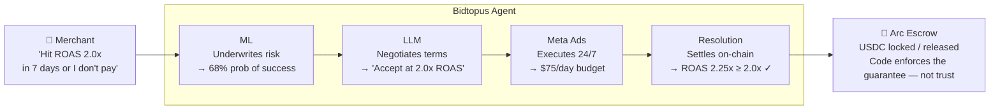
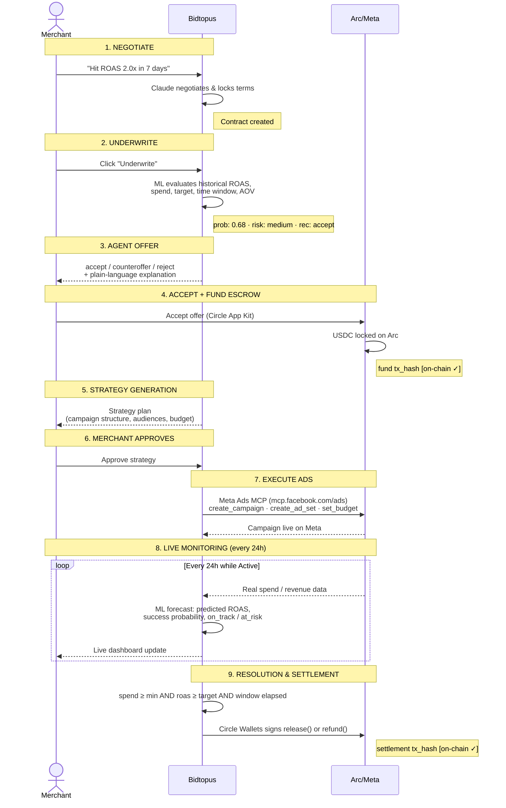
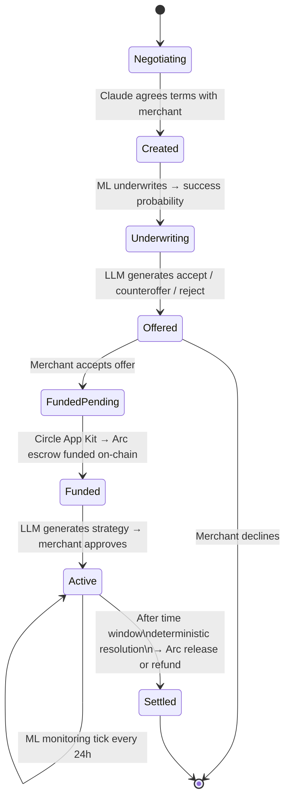
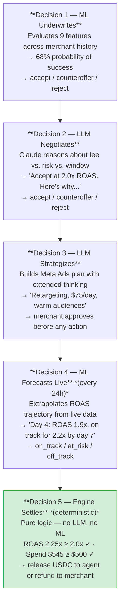
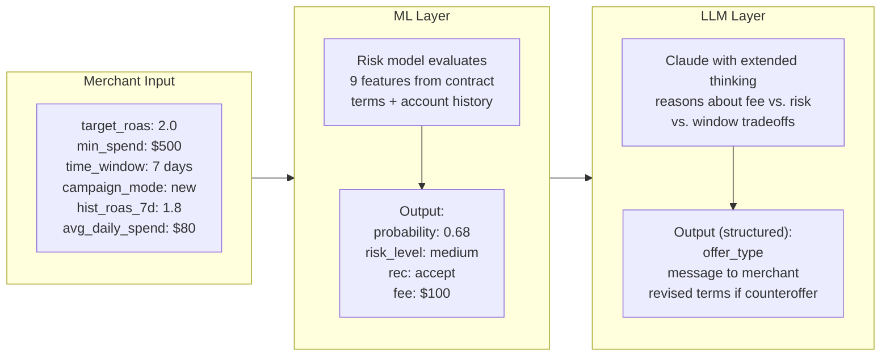
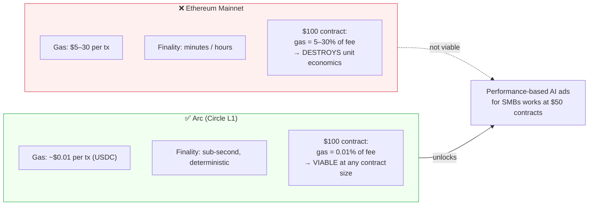

<p align="center">
  
</p>

# Bidtopus

**Performance-paid AI agent for Meta Ads. Brands pay only when the agent delivers the contracted ROAS. Settled in USDC on Arc.**

Agora Agents Hackathon · Canteen × Circle · May 11–25, 2026

---

## What It Does

A merchant offers a USDC success fee for a measurable marketing target (e.g. ROAS >= 2.0 within 7 days). The AI agent underwrites the contract using ML, negotiates terms, executes a Meta Ads strategy, monitors performance, and receives payment only if the agreed outcome is achieved. Settlement is trustless — USDC is held in escrow on Arc and released or refunded by a smart contract.

---

## How It Works

### The Core Concept: A Risk-Sharing Economic Agent



### Full Contract Lifecycle



### Contract Status Flow



### The 5 Autonomous Decisions



### How ML and LLM Work Together



### Why USDC & Circle

Performance contracts require a settlement currency that is:
- **Stable** — the merchant's locked fee doesn't change value between signing and settlement
- **Programmable** — a smart contract can hold, release, or refund it without a human intermediary
- **Regulated and trusted** — merchants won't lock real money into a token they don't recognize

USDC is the answer to all three. It is the leading regulated digital dollar — fully backed 1:1 by cash and short-term US Treasuries, with monthly third-party attestations published by Circle. Unlike algorithmic stablecoins, USDC has never broken its peg. Unlike USDT, Circle operates under US money transmission regulation and publishes full reserve transparency.

Arc is Circle's purpose-built L1 blockchain. USDC is Arc's native currency — every transaction (funding, release, refund) is denominated in USDC, including gas fees via Paymaster. There is no volatile token in the system. A merchant who funds a $200 USDC escrow on Monday will see exactly $200 USDC released or refunded at settlement — no slippage, no gas surprises, no exchange rate risk.

This is why Bidtopus is built on Circle infrastructure rather than a general-purpose chain: the entire stack — stablecoin, wallets, gas, escrow — is unified under one regulated, dollar-denominated system that any ecommerce merchant can understand.

### Circle Stack

| Circle Product | How Bidtopus Uses It | Lifecycle Step |
|---|---|---|
| **Arc Escrow** | USDC locked at contract signing. Released on success, refunded on failure. Code enforces the guarantee — not the agent's word. | Step 4: Fund · Step 9: Settle |
| **Circle Wallets** | Agent's receiving wallet. Funded by Arc escrow on success. Automated HSM-backed key management — agent never touches raw keys. | Step 9: Success path |
| **Paymaster** | All on-chain transactions (fund, release, refund) paid in USDC. No volatile gas token. Merchant pays in USDC, agent earns in USDC — fees are invisible. | Steps 4, 9 |
| **App Kit** | Drop-in wallet component in the merchant's browser. One-click USDC funding. No MetaMask required. | Step 4: Fund Escrow |
| **USYC** *(roadmap)* | Park idle escrowed USDC in yield while contract is Active. Convert back to USDC at resolution. Merchant capital earns while the agent works. | Active (days 1–7) |

### Why Arc Makes This Possible



---

## Repo Structure

```
Bidtopus/
├── frontend/     Next.js web app — the merchant-facing UI
├── backend/      FastAPI API + database — routes and persists contract state
├── agent/        AI agent — ML underwriting, LLM negotiation, ads execution, settlement
└── contracts/    Solidity escrow contract — deployed once to Arc testnet
```

Each folder has its own `PRD.md` with full build requirements for that component.

---

## Deployment Topology

Each folder deploys independently. The GitHub repo is shared; the deployment targets are not.

```
frontend/   →  Vercel          (Next.js, auto-deploys on push)
backend/    →  Railway/Render  (FastAPI + agent, Python service)
agent/      →  same service as backend (imported as a local Python module)
contracts/  →  Arc testnet     (one-time deploy via Hardhat, produces a contract address)
```

---

## Deployment Setup

### frontend/ → Vercel

1. Connect the GitHub repo to Vercel
2. In Vercel project settings, set **Root Directory** to `frontend`
3. Framework preset: **Next.js** (auto-detected)
4. Add environment variables (see below)
5. Every push to `main` auto-deploys

### backend/ + agent/ → Railway (or Render)

`backend/` and `agent/` deploy together as a single Python service. The backend imports agent modules directly — no HTTP between them.

**On Railway:**
1. Create a new project → Deploy from GitHub repo
2. Set **Root Directory** to `backend`
3. Railway auto-detects the Python service via `requirements.txt` or `Pyproject.toml`
4. Add environment variables (see below)
5. Set start command: `uvicorn main:app --host 0.0.0.0 --port $PORT`

**Making agent/ importable from backend/:**
Add a path reference in `backend/` so it can import from `../agent/`, or symlink `agent/` inside `backend/` at deploy time. Simplest approach: add this to the Railway start command or a `Procfile`:
```bash
PYTHONPATH=/app:/app/../agent uvicorn main:app --host 0.0.0.0 --port $PORT
```

### contracts/ → Arc Testnet (one-time)

Contracts are not a running server. They are deployed once and produce a contract address that everything else references.

**Already deployed:** `0xfc1c0ede47a43A38c4335ed60C64A133433Ee6c8` on Arc testnet. Only redeploy if the contract code changes.

To redeploy:
```bash
cd contracts
npm install
echo "yes" | npx hardhat run scripts/deploy.js --network arc
```

Then set `ESCROW_CONTRACT_ADDRESS` in `backend/.env` and `agent/.env`. See `contracts/README.md` for the full key setup guide.

Reference docs:
- Arc developer docs: https://docs.arc.network
- Circle developer docs: https://developers.circle.com
- Arc testnet explorer: https://testnet.arcscan.app

---

## Environment Variables

### frontend/
| Variable | Description |
|---|---|
| `NEXT_PUBLIC_API_URL` | URL of the deployed backend service |
| `NEXT_PUBLIC_ARC_EXPLORER_URL` | Arc block explorer base URL (for tx hash links) |
| `NEXT_PUBLIC_CLERK_PUBLISHABLE_KEY` | Clerk publishable key (from Clerk dashboard — safe to expose) |
| `CLERK_SECRET_KEY` | Clerk secret key — Next.js server-side only, never sent to browser |

### backend/ + agent/
| Variable | Description |
|---|---|
| `DATABASE_URL` | Neon pooled connection string (copy the **pooled** URL from Neon dashboard) |
| `CLERK_SECRET_KEY` | Clerk secret key — used to verify JWTs on every request |
| `ANTHROPIC_API_KEY` | Claude API key for LLM negotiation and strategy generation |
| `ARC_RPC_URL` | Arc testnet RPC — use `https://rpc.testnet.arc.network` |
| `ESCROW_CONTRACT_ADDRESS` | Deployed Arc escrow contract address (from `contracts/out/address.json`) |
| `CIRCLE_API_KEY` | Circle API key — from console.circle.com → Keys → API Keys |
| `CIRCLE_WALLET_SET_ID` | Circle wallet set ID — created via `agent/setup_circle_wallet.py` |
| `AGENT_WALLET_ID` | Circle wallet ID for the settler — created via `agent/setup_circle_wallet.py` |
| `ENTITY_SECRET` | 32-byte hex secret for Circle developer-controlled wallets — generated once, never changes |
| `META_ADS_ACCESS_TOKEN` | Meta Ads API token (optional — mock adapter used if absent) |

### contracts/ (deploy time only)
| Variable | Description |
|---|---|
| `ARC_RPC_URL` | Arc testnet RPC endpoint |
| `DEPLOYER_PRIVATE_KEY` | Wallet that pays for contract deployment |
| `USDC_TOKEN_ADDRESS` | USDC contract address on Arc testnet |
| `SETTLER_ADDRESS` | Wallet address authorized to call release/refund |

---

## New Developer Onboarding

Everything you need after cloning the repo.

### 1. Clone and open your component

```bash
git clone https://github.com/SankaiAI/Bidtopus.git
cd Bidtopus
```

Open **only your component folder** in VS Code — Claude Code reads the `CLAUDE.md` in your working directory to know what you own and how to behave.

### 2. Install Claude Code

```bash
npm install -g @anthropic/claude-code
```

Authenticate with your Anthropic account when prompted.

### 3. Install GitHub CLI and authenticate

**Windows:**
```bash
winget install --id GitHub.cli
```
**Mac:**
```bash
brew install gh
```

Then authenticate:
```bash
gh auth login
# Choose: GitHub.com → HTTPS → Login with a web browser
```

This also sets up `git credential fill` which the CLAUDE.md session setup relies on.

### 4. Get access to the GitHub project board

Ask the repo owner to invite you to [github.com/users/SankaiAI/projects/2](https://github.com/users/SankaiAI/projects/2) so you can monitor tickets.

### 5. Start your Claude Code session

Open your component folder in VS Code, open Claude Code, and say:

> "Check for your tickets"

Claude will read your `CLAUDE.md`, run the setup, and report any open tickets assigned to your component.

---

## Local Development

Each folder runs independently in local dev. You do not need to run all four at once.

```bash
# Frontend
cd frontend && npm install && npm run dev

# Backend + Agent
cd backend && pip install -r requirements.txt && uvicorn main:app --reload

# Contracts (compile only, no local chain needed for MVP)
cd contracts && # follow contracts/PRD.md
```

For local backend → Arc testnet interaction, set `ARC_RPC_URL=https://rpc.testnet.arc.network` in your `.env`.

---

## Team

| Area | Folder |
|---|---|
| Frontend | `frontend/` |
| Backend + Agent | `backend/` + `agent/` |
| Smart Contracts | `contracts/` |

---

## License

Copyright (C) 2026 SankaiAI

This program is free software: you can redistribute it and/or modify it under the terms of the GNU Affero General Public License as published by the Free Software Foundation, either version 3 of the License, or (at your option) any later version. See [LICENSE](LICENSE) for details.
