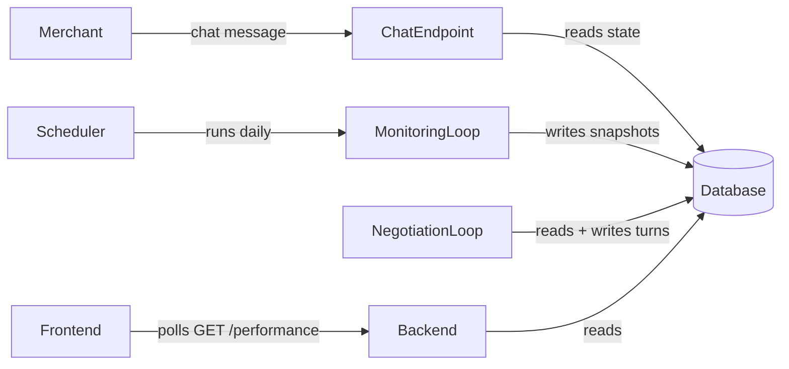

# Bidtopus — Agent

## Purpose
The agent is the core of Bidtopus. It underwrites performance contracts (ML), negotiates terms (LLM), executes Meta Ads strategies, monitors campaign performance, and triggers USDC settlement on Arc. It runs as a standalone FastAPI service called by the backend over HTTP.

**The agent decides. The backend routes and persists. The frontend renders.**

---

## Team Map — Who Does What

| Component | What it owns | Submit a `needs:` ticket when... |
|---|---|---|
| **frontend** | Merchant-facing web app — all UI, Clerk auth, Circle App Kit wallet connection | You need a UI change or a new data field surfaced to the merchant |
| **backend** | REST API, PostgreSQL database, state machine enforcement, Clerk JWT verification | You need a new DB field, a schema change, or a different endpoint behavior |
| **agent** ← you are here | ML underwriting, LLM negotiation, strategy generation, Meta Ads execution, Arc settlement | N/A — others submit tickets to you |
| **contracts** | Solidity escrow contract on Arc testnet — ABI, deployed address, settlement logic | You need the escrow contract address/ABI to wire up the Arc escrow adapter |

**Escalate to `needs: human` for:** PRD changes, spec conflicts between components, or any decision that affects more than one component's behavior.

---

## Quickstart — Running Locally

The agent is a standalone FastAPI service running on port **8001**. The backend calls it over HTTP. Start them independently.

### 1. Create and activate the virtual environment

```bash
cd agent/
python -m venv .venv

# Mac / Linux
source .venv/bin/activate

# Windows
.venv\Scripts\activate
```

### 2. Install dependencies

```bash
pip install -r requirements.txt
```

### 3. Configure environment variables

```bash
cp .env.example .env
```

Open `.env` and fill in the required values:

| Variable | Required | Notes |
|---|---|---|
| `ANTHROPIC_API_KEY` | Yes | Powers LLM negotiation and strategy generation |
| `DATABASE_URL` | Yes | Postgres — use a Neon branch for local dev (see step 4) |
| `META_ADS_ACCESS_TOKEN` | No | Leave blank — `META_ADS_MOCK=True` by default |
| `CIRCLE_API_KEY` | No | Leave blank — `CIRCLE_MOCK=True` by default |
| `ARC_RPC_URL` | No | Leave blank — `ARC_MOCK=True` by default |

All three mock flags default to `True`, so the agent runs fully locally without any third-party credentials beyond `ANTHROPIC_API_KEY` and `DATABASE_URL`.

### Meta Ads MCP Authentication

When you are ready to run against real Meta Ads (set `META_ADS_MOCK=False`), the agent connects to the **Meta Ads MCP server** at `https://mcp.facebook.com/ads` using the MCP protocol. It does **not** call the Graph API directly.

**Required env var:** `META_ADS_ACCESS_TOKEN`

This must be a Meta **user access token** with the following permissions:
- `ads_management` — create/update campaigns, ad sets, and budgets
- `ads_read` — read campaign performance (spend, revenue, ROAS)

**How to obtain the token:**

1. Go to [Meta for Developers](https://developers.facebook.com) and open your app.
2. Navigate to **Tools → Graph API Explorer**.
3. Select your app, set **User or Page** to your ad account user, and request the `ads_management` and `ads_read` permissions.
4. Click **Generate Access Token** and complete the OAuth flow.
5. Copy the token into your `.env`:

```
META_ADS_ACCESS_TOKEN=<your-token>
META_ADS_MOCK=False
```

> **Note:** User access tokens expire in ~60 days. For production, use a long-lived token or the Meta Business SDK to automate refresh. The agent will raise `MetaAdsError` immediately on startup if `META_ADS_ACCESS_TOKEN` is empty and `META_ADS_MOCK=False`.

**MCP tools called by the agent:**

| Adapter method | MCP tool |
|---|---|
| `execute_action("create_campaign")` | `create_campaign` |
| `execute_action("create_ad_set")` | `create_ad_set` |
| `execute_action("set_budget")` | `set_budget` |
| `execute_action("update_targeting")` | `update_targeting` |
| `execute_action("pause_ad_set")` | `pause_ad_set` |
| `get_performance(contract_id, day)` | `get_campaign_performance` |

### 4. Set up a local database branch (Neon)

```bash
npm install -g neonctl
neon auth
neon branches create --name dev/yourname
neon connection-string --branch dev/yourname   # paste output into DATABASE_URL in .env
```

### 5. Start the agent service

Run from inside the **`agent/` directory**:

```bash
uvicorn main:app --reload --port 8001
```

Confirm it's running:

```bash
curl http://localhost:8001/health
# → {"status":"ok","model":"claude-sonnet-4-6","mock_mode":{...}}
```

API docs are available at `http://localhost:8001/docs`.

### 7. Start the backend (separate terminal)

```bash
cd ../backend
# ensure backend is configured to call agent at http://localhost:8001
fastapi dev main.py
```

The backend routes agent calls to `http://localhost:8001/agent/<endpoint>` with `{ "contract_id": "..." }` in the request body.

---

## Purpose
The agent is the core of the product. It is an autonomous economic agent that evaluates performance contracts, negotiates terms, executes marketing strategies, monitors outcomes, and triggers settlement. It combines ML models for quantitative risk estimation with an LLM for reasoning, explanation, and strategy generation.

**Start here:** Read [AGENT.md](AGENT.md) before any component file. It is the table of contents for everything below.

---

## Engineering Principles (Read Before Building)

These come from Anthropic and OpenAI's published lessons on production autonomous agents.

---

### Principle 1: No Keyword Routing

The most common agent mistake. Never parse text to decide what action to take.

**Wrong:**
```python
if "ROAS" in message: call_underwriting()
elif "strategy" in message: call_strategy_generator()
else: default_response()  # breaks on every edge case
```

**Right — two patterns, used in different places:**

For the **orchestrator** (what to do next in the workflow): the contract's current state determines the next valid action. No text parsing.

```python
VALID_ACTIONS = {
    "Created":       ["run_underwriting"],
    "Underwriting":  ["generate_offer"],
    "Offered":       ["await_merchant_response"],
    "Funded":        ["generate_strategy"],
    "Active":        ["run_daily_monitoring", "execute_optimization"],
    "Resolving":     ["run_resolution_engine"],
}
```

For the **chat endpoint** (answering merchant questions): give Claude a set of tools and let it decide which to call.

```python
tools = [
    {"name": "get_live_performance",  "description": "Get current ROAS, spend, revenue"},
    {"name": "get_forecast",          "description": "Get ML prediction for contract success"},
    {"name": "get_contract_terms",    "description": "Get agreed target, fee, window, strategy"},
    {"name": "request_strategy_change","description": "Queue adjustment for merchant approval"},
]
response = claude.messages.create(model="claude-sonnet-4-6", tools=tools, messages=[...])
```

---

### Principle 2: Three Interaction Modes — Never Mix Them



| Mode | Triggered by | Pattern |
|---|---|---|
| **Negotiation loop** | Merchant submits contract | Sequential turns, each turn persisted to DB. Loop exits when agent reaches accept or reject. |
| **Background scheduler** | Contract status → Active | APScheduler job every 24h. Runs independently of any user request. Writes snapshots to DB. |
| **Chat Q&A** | Merchant sends a message | Read current DB state + audit log. Answer with Claude. No execution. |

The UI reads from DB. The scheduler writes to DB. They never block each other.

---

### Principle 3: The Iterative Loop Pattern — Agent Decides When to Stop

From Anthropic's multi-agent article: the agent decides when the loop exits, not the frontend, not a fixed counter. The termination condition is evaluated by the agent itself.

```python
def negotiation_loop(contract_id: str):
    while True:
        state = db.get_contract_state(contract_id)

        # Save intent BEFORE executing (checkpoint pattern)
        audit_logger.log(contract_id, "negotiation_step", {"state": state})

        underwriting = run_underwriting(state)
        offer = generate_offer(underwriting)

        db.save_offer(contract_id, offer)

        if offer.offer_type in ("accept", "reject"):
            break  # Agent decides to exit — not a timer, not the frontend

        merchant_response = db.poll_merchant_response(contract_id)
        db.save_negotiation_turn(contract_id, merchant_response)
```

The same pattern applies to the monitoring loop:
```python
def monitoring_loop(contract_id: str):
    while True:
        snapshot = meta_ads_adapter.get_performance(contract_id)
        audit_logger.log(contract_id, "snapshot_before", snapshot)

        forecast = forecast_model.predict(snapshot)

        if needs_optimization(forecast):
            action = generate_optimization(forecast)
            audit_logger.log(contract_id, "intent", action)     # log BEFORE
            meta_ads_adapter.execute(action)
            audit_logger.log(contract_id, "executed", action)   # log AFTER

        if is_contract_resolved(snapshot):
            resolution_engine.resolve(contract_id)
            break  # Agent exits when it determines the outcome, not on a timer

        sleep_until_next_day()
```

---

### Principle 4: Save State Before Acting (Checkpoint Pattern)

From OpenAI's observability diagrams: the agent saves its plan to memory **before** executing. This enables crash recovery for 7-day contracts.

```python
def orchestrator_step(contract_id: str, action: str, inputs: dict):
    # Step 1: persist intent — crash here means no action was taken
    audit_logger.log(contract_id, "intent", {"action": action, "inputs": inputs})

    # Step 2: execute
    result = execute(action, inputs)

    # Step 3: persist result — crash here means action happened, result is known
    audit_logger.log(contract_id, "result", {"action": action, "result": result})

    return result
```

If the process restarts, read the last intent from audit_logger to determine where to resume.

---

### Principle 5: Dual-Write — Audit Logger + Message Store

Every notable agent action writes to **two** stores. Never conflate them.

```python
# When the agent runs a daily monitoring tick:

# Write 1 — internal (always, every component call)
audit_logger.log(contract_id, "meta_ads", "snapshot", snapshot.model_dump())

# Write 2 — UI (only when the merchant should see something new)
messages_repo.append(contract_id,
    role="agent", type="daily_update",
    content=f"Day {day}: ROAS {snapshot.roas:.2f}x | Spend ${snapshot.spend:.0f}",
    metadata={"snapshot": snapshot.model_dump(), "forecast": forecast.model_dump()}
)
```

> ⚠️ **Negotiation offers are the exception**: the orchestrator only writes
> `llm_negotiation` to `audit_logger`. The backend persists the offer message
> to `contract_messages` after the agent's HTTP response returns (so it can
> attach the `offer_id` it just minted). Writing here too produces duplicate
> bubbles on workspace restore — see [issue #83](https://github.com/SankaiAI/Bidtopus/issues/83).

What each component writes to `contract_messages`:

| Component | `type` | When |
|---|---|---|
| Orchestrator | `system_event` | Contract created, escrow confirmed, campaign launched, settled |
| LLM Negotiation | `message` | Turn-limit auto-reject only (regular offers are persisted backend-side) |
| LLM Strategy | `approval_request` (status=`pending`) | Strategy plan ready for merchant review |
| Background Scheduler | `daily_update` | Each daily monitoring tick with ROAS + forecast |
| Orchestrator (optimization) | `approval_request` (status=`pending`) | Budget shift > threshold, needs merchant approval |
| Resolution Engine | `message` | Outcome narration after deterministic resolution |

### Principle 6: The Audit Logger is Queryable, Not Write-Only

From OpenAI's observability stack: the agent needs to **query its own history** to reason about it.

```python
# These query patterns must work from day 1:
audit_logger.get_all(contract_id)                        # full history
audit_logger.get_latest_snapshot(contract_id)            # most recent performance data
audit_logger.get_by_component(contract_id, "llm")        # all LLM decisions
audit_logger.get_by_component(contract_id, "resolution") # final resolution inputs/outputs
audit_logger.get_since(contract_id, days_ago=3)          # recent events for chat Q&A
```

The chat endpoint uses `get_since()` to give Claude context for answering "how are we tracking?" without loading the full 7-day history.

---

### Principle 6: Layered Domain Architecture

From OpenAI's Codex engineering: **one-way dependency rule** — no layer imports from a layer above it. Enforced by file structure, not by discipline.

```
Utils  ←──────────────────────────────────────────────┐
                                                       │ (used by all)
Types → Config → Repo → Service → Orchestrator → FastAPI endpoints
                   ↑
              Providers (Meta Ads, Arc, Circle)
              └──→ Orchestrator
```

| Layer | Files | Rule |
|---|---|---|
| **Types** | `models/types.py` | Pydantic models only — no logic, no imports from above |
| **Config** | `config.py` | Thresholds, env vars, decision policy constants |
| **Repo** | `db/repo.py` + `db/audit_logger.py` | DB reads/writes only — no business logic |
| **Service** | `ml/`, `llm/`, `engine/` | Business logic — imports Types, Config, Repo only |
| **Providers** | `adapters/` | External API calls — imports Types only |
| **Orchestrator** | `orchestrator.py` | Sequences Service + Provider calls — imports everything below |
| **Utils** | `utils/` | Shared helpers — no business logic, no upward imports |

---

### Principle 7: What the LLM Can and Cannot Do

The LLM is sandwiched between a JSON validator and a state gate. It cannot bypass either.

```
Merchant input
     ↓
   LLM (interprets, reasons, generates)
     ↓
JSON schema validator  ← LLM output is rejected here if invalid
     ↓
State gate check       ← action is blocked here if contract state is wrong
     ↓
Executor (adapter or engine)
```

| LLM CAN do | LLM CANNOT do |
|---|---|
| Explain underwriting output | Determine if 2.25 >= 2.0 |
| Generate counteroffers | Override the resolution engine |
| Produce strategy plans | Move funds or call escrow adapters directly |
| Narrate the outcome | Change the deterministic settlement result |

---

## Security Rules

### Merchant Input Never in the System Prompt

Every merchant-controlled field (`campaign_goal`, `account_context`, chat messages) goes in the `user` turn as structured JSON — never interpolated into the `system` prompt. The system prompt is a fixed constant.

```python
# WRONG — merchant text in system prompt = prompt injection risk
system = f"You manage campaigns. Goal: {contract.campaign_goal}"

# CORRECT — system prompt is a constant, merchant data is structured user input
response = claude.messages.create(
    system=FIXED_NEGOTIATION_SYSTEM_PROMPT,
    messages=[{"role": "user", "content": json.dumps(contract_terms.model_dump())}]
)
```

The ML model calculates the probability — not the LLM. Even a successfully injected prompt cannot change the number that drives the accept/reject decision.

### JSON Validation Blocks Every LLM Output

Every LLM response is validated by a Pydantic model with explicit field constraints before any action. Invalid output raises `SafeAgentError` — never silently defaults.

```python
try:
    offer = AgentOffer.model_validate_json(raw_output)
except ValidationError as e:
    audit_logger.log(contract_id, "llm_negotiation", "error", {"error": str(e)})
    raise SafeAgentError("LLM output failed schema validation")
```

### Chat Handler Has Zero Imports from Execution Modules

Verified by a structural test in `tests/test_security.py`. The chat route file must never import `arc_escrow_adapter`, `meta_ads_adapter`, `resolution_engine`, or `orchestrator`.

### `AccountContext` Rejects Unknown Fields

```python
class AccountContext(BaseModel):
    model_config = ConfigDict(extra="forbid")  # unknown keys = 422 at API boundary
    account_id: str = Field(pattern=r"^act_\d+$")
    pixel_id:   str | None = Field(None, pattern=r"^\d+$")
```

### Approval Status Re-Read from DB with Row Lock

```python
strategy = db.query(StrategyPlan).filter_by(contract_id=contract_id).with_for_update().first()
if not strategy or strategy.approval_status != "approved":
    raise SafeAgentError("Approval gate: strategy not approved in DB")
```

### Negotiation Loop Has a Turn Limit

```python
MAX_NEGOTIATION_TURNS = 5
if turn_count >= MAX_NEGOTIATION_TURNS:
    # Auto-reject — prevents runaway API cost from adversarial looping
```

→ Full security reference with all rules and code examples: [docs/security.md](docs/security.md)

---

## File Structure

```
agent/
├── AGENT.md                  ← ~100 lines, table of contents (read first)
├── orchestrator.py           ← Entry point — sequences components by contract state
├── config.py                 ← All thresholds and decision policy constants
├── models/
│   └── types.py              ← Pydantic models for all inputs/outputs
├── ml/
│   ├── underwriting.py       ← ML Contract Underwriting Model
│   └── forecast.py           ← ML Live Outcome Forecast Model
├── llm/
│   ├── negotiation.py        ← LLM Negotiation Layer (extended thinking)
│   └── strategy.py           ← LLM Strategy Generator (extended thinking)
├── engine/
│   └── resolution.py         ← Deterministic Resolution Engine — no LLM here
├── adapters/
│   ├── meta_ads.py           ← Meta Ads Adapter (real + mock)
│   ├── arc_escrow.py         ← Arc Escrow Adapter
│   └── circle_wallets.py     ← Circle Wallets Integration
├── db/
│   ├── audit_logger.py       ← Internal observability store (queryable)
│   └── messages_repo.py      ← Merchant-facing UI timeline store
├── docs/
│   ├── lifecycle.md          ← State machine, valid transitions
│   ├── underwriting.md       ← ML model inputs, outputs, thresholds
│   ├── negotiation.md        ← Negotiation loop, offer types, fee logic
│   ├── safety-rules.md       ← Hard constraints — structural, not prompts
│   ├── meta-ads.md           ← Adapter actions, mock data, realistic progression
│   └── observability.md      ← Audit logger schema, query patterns, crash recovery
└── tests/
    └── evals/                ← 20+ test scenarios for LLM output validation
```

---

## Build Order

Build in this order — each step depends only on layers already complete.

1. `models/types.py` — all Pydantic models (Types layer, no dependencies)
2. `config.py` — all thresholds (Config layer)
3. `db/audit_logger.py` — queryable from day 1 (Repo layer)
4. `db/messages_repo.py` — `append()`, `get_all()`, `update_status()` (Repo layer)
4. `engine/resolution.py` — pure deterministic logic (Service layer, no LLM)
5. `ml/underwriting.py` — with synthetic training data (Service layer)
6. `ml/forecast.py` — gradient boosting or rule-based hybrid (Service layer)
7. `adapters/meta_ads.py` — mock adapter first, real later (Providers layer)
8. `adapters/arc_escrow.py` — reads ABI from `contracts/out/` (Providers layer)
9. `adapters/circle_wallets.py` — agent wallet provisioning (Providers layer)
10. `llm/negotiation.py` — structured JSON + extended thinking (Service layer)
11. `llm/strategy.py` — structured JSON + extended thinking (Service layer)
12. `orchestrator.py` — wires all components, state-machine routing (Orchestrator layer)
13. `tests/evals/` — 20+ LLM eval scenarios before connecting to backend

---

## What Needs to Be Built

### 1. ML Underwriting Model
Answers: "If I accept this contract, how likely am I to achieve the target?"
- Inputs: target ROAS, spend floor, time window, historical ROAS baseline, campaign mode
- Outputs: `success_probability`, `risk_level`, `expected_roas_range`, `recommended_action`, `recommended_fee_usdc`
- Decision policy: >= 65% → accept, 35–64% → counteroffer, < 35% → reject
- Model type: Logistic Regression baseline, XGBoost/LightGBM preferred
- If no real data: generate a synthetic dataset with plausible distributions

### 2. LLM Negotiation Layer
Answers: "How do I explain this and what do I propose?"
- Receives ML underwriting output + original contract request
- Returns structured JSON: `offer_type`, `message`, `revised_threshold`, `revised_fee_usdc`, `revised_time_window_days`
- Use extended thinking (`thinking` parameter) — this is a complex reasoning step
- JSON schema validated before returning to orchestrator

### 3. LLM Strategy Generator
Answers: "What Meta Ads strategy should I run?"
- Receives approved contract terms + account context
- Returns structured JSON: `strategy_summary`, `actions[]`
- Output shown to merchant for approval before any action executes
- Use extended thinking

### 4. ML Live Outcome Forecast Model
Answers: "Given current progress, will I succeed by the deadline?"
- Inputs: current spend, revenue, ROAS, days elapsed, days remaining, target, spend floor
- Outputs: `predicted_final_roas`, `success_probability`, `status` (on_track / at_risk / off_track)
- Runs on every daily monitoring tick

### 5. Deterministic Resolution Engine
Answers: "Did the contracted outcome get achieved?"
- Pure logic: `spend >= min_spend AND final_roas >= target_roas AND window_complete`
- No ML. No LLM. This is what triggers USDC settlement.
- Output logged to audit logger before any settlement adapter is called

### 6. Meta Ads Adapter
- Read performance data, create campaigns, create ad sets, set budgets
- Mock adapter returns realistic day-by-day ROAS progression for demo

### 7. Arc Escrow Adapter
- Reads ABI and address from `contracts/out/abi.json` + `contracts/out/address.json`
- Calls `release()` on success, `refund()` on failure
- Returns Arc tx hash for every settlement action

### 8. Circle Wallets Integration
- Provisions agent wallet for receiving USDC on success
- Reports agent wallet balance for transparency

### 9. Audit Logger
- Queryable by contract_id, component, timestamp range
- Every component call logs inputs + outputs + timestamp
- The backbone for crash recovery and chat Q&A context

---

## CLI Reference

### FastAPI + Uvicorn

The agent runs as a module inside the backend service. Start via the backend:

```bash
fastapi dev ../backend/main.py               # dev server — agent is imported automatically
uvicorn main:app --reload --log-level debug  # verbose mode to see every agent step in stdout
```

Docs: https://fastapi.tiangolo.com/deployment/manually/

### Neon CLI

The agent shares the same Neon database as the backend. Use your own branch for local dev:

```bash
npm install -g neonctl
neon auth

neon branches create --name dev/yourname         # isolated DB branch for local agent testing
neon connection-string --branch dev/yourname     # get DATABASE_URL for your .env
neon branches list                               # see all active branches
```

Docs: https://neon.com/docs/reference/neon-cli

> Use a dedicated Neon branch when testing agent behavior locally — it prevents your test data from polluting the shared dev database.
