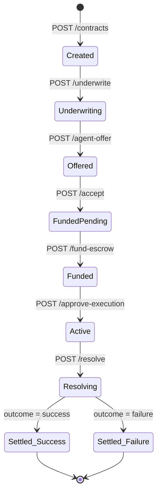

# OutcomeX — Backend

## Purpose
The backend is the API and data layer. It receives requests from the frontend, persists all contract state to the database, and routes work to the agent. It is intentionally thin — business logic lives in the agent, not here.

**The backend's job: route, persist, and enforce state gates. It does not decide.**

---

## Engineering Principles (Read Before Building)

---

### Principle 1: The Backend is a Thin Routing Layer

The backend adds exactly two things that the agent doesn't have: pre-condition checks (no endpoint runs out of sequence) and persistence. Everything else is the agent.

```
Frontend request
      ↓
  FastAPI route  (validate input shape)
      ↓
  State gate     (is the contract in the right state for this action?)
      ↓
  Agent call     (do the actual work)
      ↓
  Persist result (write to DB)
      ↓
  Return response
```

If a request arrives for an action the contract isn't ready for — it returns 400. No agent work happens.

---

### Principle 2: Contract State Machine

The backend is the source of truth for contract state. Every endpoint checks it before proceeding.



No transition skips a step. Calling `/approve-execution` when the contract is still `Created` returns 400.

---

### Principle 3: Layered Domain Architecture — One-Way Dependencies

No layer imports from a layer above it. This is enforced by file structure.

```
Types → Config → Repo → Service → Routes
                   ↑
           AgentCaller (calls agent module)
```

| Layer | Files | Rule |
|---|---|---|
| **Types** | `models/schemas.py` | Pydantic request/response schemas — no logic |
| **Config** | `config.py` | Env vars, DB URL, timeouts |
| **Repo** | `db/repo.py` | SQL queries only — no business logic |
| **Service** | `services/contract_service.py` | State transitions + pre-condition checks |
| **Routes** | `routes/contracts.py` | Thin — parse input, call service, return response |
| **AgentCaller** | `agent_client.py` | Calls agent orchestrator — single import boundary |

The `AgentCaller` is the only file that imports from `agent/`. Everything else in the backend is pure DB + routing.

---

### Principle 4: Safety Gate Pattern — Every State Transition is Guarded

Every endpoint that changes contract state must check pre-conditions before calling the agent. These are structural checks in code, not prompt instructions.

```python
@router.post("/contracts/{id}/execute-ads-actions")
def execute_ads(contract_id: str, db: Session = Depends(get_db)):
    contract = repo.get_contract(db, contract_id)
    strategy  = repo.get_strategy_plan(db, contract_id)

    # Hard gates — 400 if violated, no agent call
    if contract.status != "Active":
        raise HTTPException(400, "Contract must be Active")
    if strategy is None or strategy.approval_status != "approved":
        raise HTTPException(400, "Strategy must be merchant-approved")

    # Only reach here if gates pass
    result = agent_client.execute_ads_actions(contract_id)
    repo.log_event(db, contract_id, "ads_executed", result)
    return result
```

Full gate reference:

| Endpoint | Required pre-condition |
|---|---|
| `POST /underwrite` | `contract.status = Created` |
| `POST /agent-offer` | `underwriting_result` exists for contract |
| `POST /accept` | `agent_offer.offer_type` in (accept, counteroffer) |
| `POST /fund-escrow` | `contract.status = FundedPending` |
| `POST /generate-strategy` | `contract.status = Funded` |
| `POST /approve-execution` | `strategy_plan.approval_status = pending` |
| `POST /execute-ads-actions` | `strategy_plan.approval_status = approved` |
| `POST /resolve` | `contract.status = Active` AND evaluation window has closed |

---

### Principle 5: The Audit Log Must Be Queryable

From OpenAI's observability lessons: the agent needs to read its own history to reason about it and to resume after a crash. The audit log is not just for humans — it is the agent's memory.

**Design the `audit_events` table with these indexed fields from day 1:**

```sql
CREATE TABLE audit_events (
    id           UUID PRIMARY KEY,
    contract_id  UUID NOT NULL,          -- indexed
    component    VARCHAR(50) NOT NULL,   -- indexed: "llm", "ml", "resolution", "adapter"
    event_type   VARCHAR(50) NOT NULL,   -- "intent", "result", "snapshot", "error"
    payload      JSONB NOT NULL,         -- inputs + outputs
    created_at   TIMESTAMPTZ NOT NULL    -- indexed
);
```

**Query patterns the agent uses:**

```python
# Chat Q&A — last 3 days of activity for context
audit_log.get_since(contract_id, days_ago=3)

# Crash recovery — what was the last intent before the crash?
audit_log.get_latest_by_type(contract_id, "intent")

# Monitoring dashboard — latest performance snapshot
audit_log.get_latest_by_component(contract_id, "meta_ads_snapshot")

# Debug — all LLM decisions for a contract
audit_log.get_by_component(contract_id, "llm")
```

---

### Principle 6: Two Message Stores — Different Purposes

Never conflate internal observability with merchant-facing UI data. Two separate tables, two separate writers, two separate readers.

| Table | Written by | Read by | Purpose |
|---|---|---|---|
| `contract_messages` | Backend (state transitions) + Agent (notable actions) | Frontend (`GET /messages`), SSE stream | Everything the merchant sees |
| `audit_events` | Agent (every component call) | Agent orchestrator (crash recovery, chat Q&A context) | Internal observability |

When the agent generates a negotiation offer it writes to both:
```python
# Internal — all inputs/outputs for debugging and crash recovery
audit_logger.log(contract_id, "llm_negotiation", "result", offer.model_dump())

# UI — only what the merchant sees
messages_repo.append(db, contract_id, "agent", "message",
    content=offer.message,
    metadata={"offer_type": offer.offer_type, "probability": underwriting.success_probability}
)
```

### Principle 7: Workspace Restore via `GET /messages`

When a merchant reopens their workspace, one query reconstructs the full timeline:

```python
@router.get("/contracts/{contract_id}/messages")
def get_messages(contract_id: str, db: Session = Depends(get_db)):
    # Returns all rows ordered by created_at ASC
    # Frontend renders each row based on its `type` field
    return repo.get_all_messages(db, contract_id)
```

The frontend hydrates from this endpoint on mount, then opens the SSE stream for new messages. On reconnect it re-calls `GET /messages` for any messages it missed while disconnected.

### Principle 8: SSE for Live Agent Updates (No Redis Needed)

The background scheduler writes to `contract_messages`. The SSE endpoint polls for new rows and pushes them to the connected client. No Redis needed at hackathon scale.

```python
from sse_starlette.sse import EventSourceResponse
import asyncio

@router.get("/contracts/{contract_id}/events")
async def stream_events(contract_id: str, db: Session = Depends(get_db)):
    async def generator():
        last_id = repo.get_latest_message_id(db, contract_id)
        while True:
            new_msgs = repo.get_messages_after(db, contract_id, after_id=last_id)
            for msg in new_msgs:
                yield {"event": msg.type, "data": msg.to_json()}
                last_id = msg.id
            await asyncio.sleep(2)  # poll DB every 2s
    return EventSourceResponse(generator())
```

SSE event types the frontend listens for:

| SSE event | Frontend action |
|---|---|
| `message` | Append agent/merchant chat bubble |
| `daily_update` | Append AGENT UPDATE · DAY N card |
| `approval_request` | Append action card with Approve / Request changes buttons |
| `system_event` | Append grey status banner |

### Principle 9: LLM Streaming for Chat Q&A

Merchant message is persisted first, response streams token-by-token, completed response is persisted after.

```python
from anthropic import Anthropic
from fastapi.responses import StreamingResponse
import json

client = Anthropic()

@router.post("/contracts/{contract_id}/chat/stream")
async def stream_chat(contract_id: str, body: ChatRequest, db: Session = Depends(get_db)):
    # 1. Persist merchant message immediately (shows in timeline instantly)
    messages_repo.append(db, contract_id, "merchant", "message", content=body.message)

    state   = repo.get_contract_full_state(db, contract_id)
    context = audit_log.get_since(db, contract_id, days_ago=3)

    async def generate():
        full_response = ""
        with client.messages.stream(
            model="claude-sonnet-4-6",
            system="You are the OutcomeX agent. Answer the merchant's question. Do not execute any actions.",
            messages=[{
                "role": "user",
                "content": f"Contract: {state}\nRecent activity: {context}\n\nMerchant: {body.message}"
            }]
        ) as stream:
            for text in stream.text_stream:
                full_response += text
                yield f"data: {json.dumps({'text': text})}\n\n"

        # 2. Persist completed response so it survives workspace reload
        messages_repo.append(db, contract_id, "agent", "message", content=full_response)
        yield "data: [DONE]\n\n"

    return StreamingResponse(generate(), media_type="text/event-stream")
```

---

## File Structure

```
backend/
├── main.py                    ← FastAPI app, middleware, startup
├── config.py                  ← Env vars, DB URL, settings
├── models/
│   └── schemas.py             ← Pydantic request/response schemas
├── db/
│   ├── models.py              ← SQLAlchemy ORM models (10 tables)
│   ├── repo.py                ← All SQL queries — no business logic here
│   ├── messages_repo.py       ← contract_messages CRUD + append helpers
│   └── session.py             ← DB connection and session management
├── services/
│   └── contract_service.py    ← State transitions, pre-condition checks
├── routes/
│   ├── contracts.py           ← All 10 contract lifecycle endpoints
│   ├── messages.py            ← GET /messages, POST /messages
│   ├── stream.py              ← GET /events (SSE), POST /chat/stream
│   └── chat.py                ← Non-streaming chat fallback
└── agent_client.py            ← Single import boundary to agent/ module
```

---

## Build Order

1. Set up Neon project — create `main` branch + one branch per developer; copy **pooled** connection string to `.env`
2. `config.py` — Neon `DATABASE_URL` (pooled), `CLERK_SECRET_KEY`, all other env vars
3. `auth/clerk.py` — `get_current_user` dependency
4. `db/session.py` — SQLAlchemy engine with Neon pool settings (`pool_recycle=300`, `pool_pre_ping=True`)
5. `models/schemas.py` — Pydantic schemas (match agent types exactly)
6. `db/models.py` — all 10 SQLAlchemy models (`users` with `clerk_user_id`)
7. `db/repo.py` — CRUD + queryable audit log queries + `get_or_create_user()`
8. `db/messages_repo.py` — `append()`, `get_all()`, `get_after_id()`, `update_status()`
9. `services/contract_service.py` — state machine transitions with pre-condition checks
10. `routes/users.py` — `POST /users/me/wallet` (wallet connect)
11. `routes/contracts.py` — all 10 lifecycle endpoints with `Depends(get_current_user)`
12. `routes/messages.py` — `GET /messages` + `POST /messages`
13. `routes/stream.py` — `GET /events` (SSE) + `POST /chat/stream` (LLM streaming)
14. `agent_client.py` — import boundary to agent module
15. `main.py` — wire all routers; add `sse-starlette`, `clerk-backend-api` to `requirements.txt`
8. `main.py` — wire everything, set up CORS, startup events

---

## What Needs to Be Built

### 1. API Layer — 10 Endpoints
All prefixed `/api`. See backend/PRD.md Section 4 for full endpoint list.

### 2. Database Models — 10 Tables
`users`, `performance_contracts`, `underwriting_results`, `agent_offers`, `escrow_records`, `strategy_plans`, `performance_snapshots`, `resolution_records`, `contract_messages`, `audit_events`

The last two are new and critical:
- `contract_messages` — merchant-facing timeline (role, type, content, metadata, status, created_at)
- `audit_events` — internal agent observability (component, event_type, payload, created_at)

Both must have indexed `contract_id` + `created_at` from day 1.

### 3. State Gate Enforcement
Every state-transition endpoint checks pre-conditions before calling the agent. See gate reference table above.

### 4. Queryable Audit Trail
`audit_events` table with indexed `contract_id`, `component`, `created_at`. Query patterns must work from day 1.

### 5. Message Timeline (`contract_messages`)
Every event visible in the merchant UI is a row. The backend appends a `system_event` row on every contract state transition. The agent appends `message`, `daily_update`, and `approval_request` rows.

### 6. Workspace Restore Endpoint
`GET /contracts/:id/messages` returns all rows ordered by `created_at ASC`. This is the single call that rebuilds the full UI on page reload.

### 7. SSE Stream
`GET /contracts/:id/events` — polls `contract_messages` for new rows every 2s and pushes them as SSE events. Install `sse-starlette`.

### 8. LLM Streaming Chat
`POST /contracts/:id/chat/stream` — persists merchant message, streams Claude response token-by-token, persists completed response. Uses `StreamingResponse` + Anthropic streaming SDK.

---

## Security Rules

### Ownership Check on Every Contract Endpoint

```python
def require_contract_owner(contract_id: str, user: User, db: Session) -> PerformanceContract:
    contract = repo.get_contract(db, contract_id)
    if not contract:
        raise HTTPException(404, "Contract not found")
    if contract.merchant_id != user.id:
        raise HTTPException(403, "Not your contract")
    return contract
```

Apply to every `/contracts/:id/*` endpoint before any state gate or agent call. Merchant A must never touch Merchant B's contract.

### Clerk JWT — Primary Auth

All identity is delegated to Clerk. The `get_current_user` FastAPI dependency verifies the Clerk JWT on every protected request. No hand-rolled JWT code.

```python
# auth/clerk.py
from clerk_backend_api import Clerk
from fastapi.security import HTTPBearer

clerk  = Clerk(bearer_auth=os.getenv("CLERK_SECRET_KEY"))
bearer = HTTPBearer()

async def get_current_user(token=Depends(bearer), db=Depends(get_db)):
    try:
        claims = clerk.verify_token(token.credentials)
    except Exception:
        raise HTTPException(401, "Invalid session token")
    return repo.get_or_create_user(db, clerk_user_id=claims["sub"], email=claims.get("email"))
```

### Wallet Address — Verified Only at Wallet Connect

`eth_account` is used once: `POST /users/me/wallet`. The merchant proves wallet ownership with a signature before the address is stored. This is not used for login.

```python
@router.post("/users/me/wallet")
def connect_wallet(body: WalletConnectRequest, current_user=Depends(get_current_user), db=Depends(get_db)):
    msg       = encode_defunct(text=f"Connect wallet to OutcomeX {current_user.clerk_user_id}")
    recovered = Account.recover_message(msg, signature=body.signature)
    if recovered.lower() != body.wallet_address.lower():
        raise HTTPException(400, "Wallet signature verification failed")
    repo.update_wallet_address(db, current_user.id, body.wallet_address)
```

### `resolve` is Idempotent — Check Before Acting

```python
existing_resolution = repo.get_resolution(db, contract_id)
if existing_resolution:
    return existing_resolution   # network retry safe — return prior result
```

### Rate Limit LLM-Calling Endpoints

```python
from slowapi import Limiter
limiter = Limiter(key_func=get_remote_address)

@router.post("/contracts/{contract_id}/underwrite")
@limiter.limit("10/minute")   # per IP — prevents API budget exhaustion
def underwrite(...): ...
```

Apply to `/underwrite`, `/agent-offer`, `/generate-strategy`, `/chat/stream`.

### Sanitize LLM Output Before Storing

```python
import bleach

content = bleach.clean(offer.message, tags=[], strip=True)  # strip all HTML
messages_repo.append(db, contract_id, "agent", "message", content=content, ...)
```

### Secrets in Railway Encrypted Store Only

Never commit: `SETTLER_PRIVATE_KEY`, `ANTHROPIC_API_KEY`, `META_ADS_ACCESS_TOKEN`, `CIRCLE_API_KEY`, `DATABASE_URL`, `JWT_SECRET`. Add a pre-commit hook that scans for these patterns.
