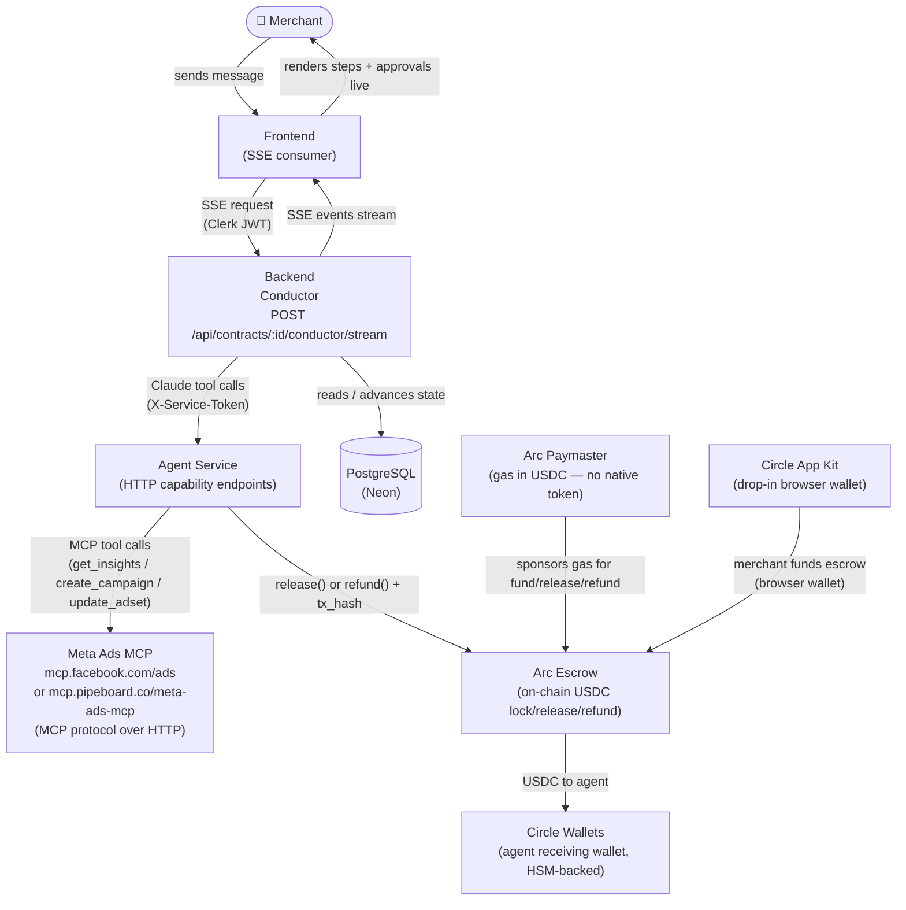
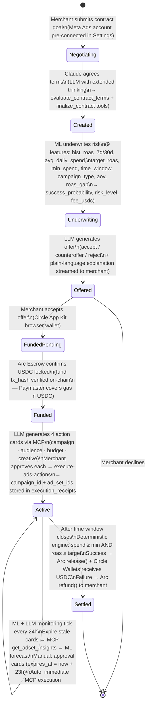
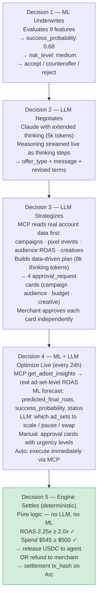
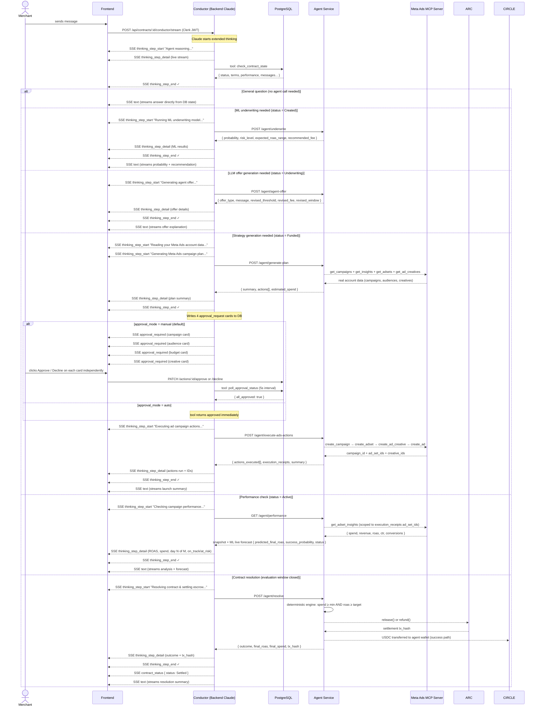
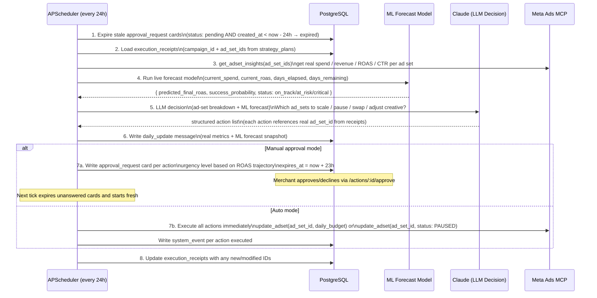
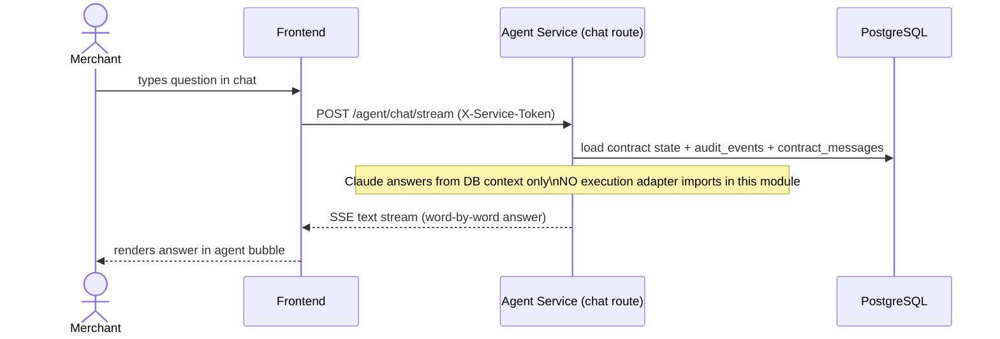
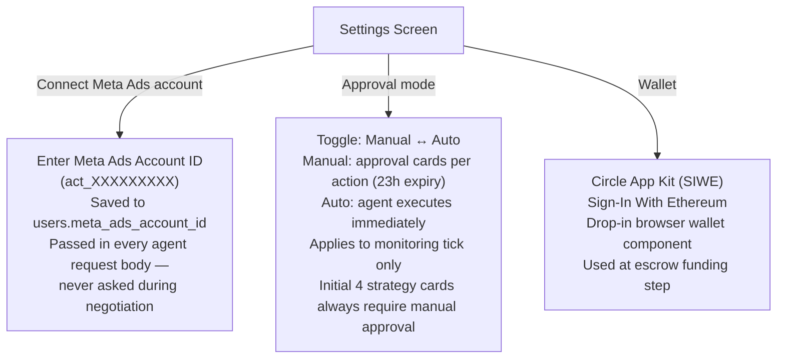
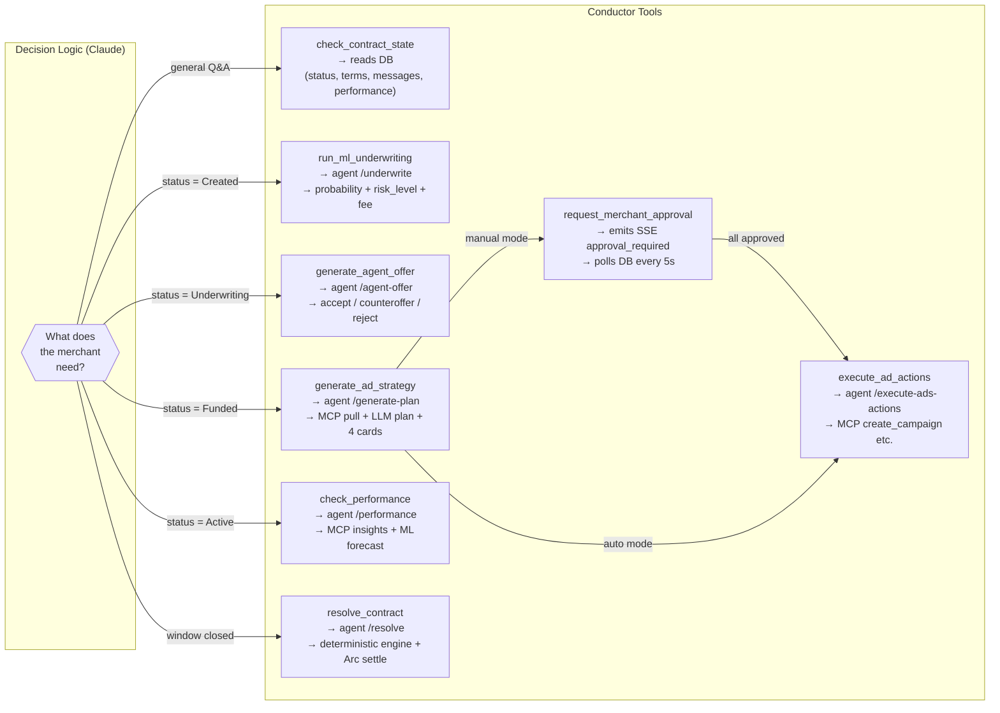

# Autonomous Agent Flow — Full System Reference

All use cases, lifecycle states, and data flows for the Bidtopus autonomous agent.

---

## 1. Architecture Overview

> **Meta Ads MCP vs Marketing API:** The agent does NOT call Meta's Marketing REST API directly.
> It connects to the MCP server via `streamablehttp_client` using `ClientSession.call_tool()` —
> the same MCP transport Claude Code uses. The `MockMetaAdsAdapter` returns deterministic fake
> data when `META_ADS_MOCK=True` and makes no external connection.

---

## 2. Full Contract Lifecycle

Nine states, five autonomous decisions, three actor types.

---

## 3. The Five Autonomous Decisions

> **The LLM never makes the settlement call.** Resolution is deterministic `roas >= target AND spend >= minimum` — auditable and tamper-proof. The LLM narrates the result; the math decides it.

---

## 4. Step-by-Step Conductor Flow

The unified `POST /api/contracts/:id/conductor/stream` endpoint. Claude decides which capability to call based on contract state and the merchant's message.

---

## 5. 24h Monitoring Tick (Background)

APScheduler runs this loop independently for every Active contract. Not triggered by the conductor.

### Urgency Levels on Approval Cards

| Level | Condition | Frontend Behaviour |
|---|---|---|
| `recommended` | Normal optimization opportunity | Standard card |
| `urgent` | ROAS trending below target, ≥3 days remaining | Card highlighted, push notification |
| `critical` | ROAS critically off track, ≤2 days remaining | Card pinned to top, notification repeated |

---

## 6. Chat Q&A Flow (Isolated Path)

The `/agent/chat` stream endpoint is structurally isolated from the execution path. No Meta Ads adapter, no Arc calls — read-only grounded Q&A only.

---

## 7. Settings & Account Connection

---

## 8. SSE Event Contract

Events emitted by the conductor in order:

| Event | Payload | Frontend Action |
|---|---|---|
| `thinking_step_start` | `{ step_id, label, thinking_sequence_id }` | Opens a new ThinkingStep row with pulsing dot |
| `thinking_step_detail` | `{ delta }` | Appends to the active step's live detail (streaming cursor) |
| `thinking_step_end` | `{ step_id, thinking_sequence_id }` | Marks step complete, shows green ✓ |
| `thinking_end` | `{ thinking_sequence_id }` | Collapses block to "Thought for N steps" |
| `text` | `{ delta }` | Appends to the agent message bubble (word-fade animation) |
| `approval_required` | `{ contract_id, action_id, title, detail, urgency, expires_at }` | Renders AgentActionCard with Approve / Decline buttons |
| `contract_status` | `{ status }` | Updates right-panel status badge without page reload |
| `error` | `{ message, correlation_id }` | Shows inline error, stops spinner |

---

## 9. Tool List (What Claude Can Call)

---

## 10. Meta Ads MCP Tools Reference

| MCP Tool | When Used | Purpose |
|---|---|---|
| `mcp_meta_ads_get_campaigns` | Strategy generation (step 5) | List active/recent campaigns |
| `mcp_meta_ads_get_insights` | Strategy generation + monitoring | Performance data (spend, revenue, ROAS, CTR) |
| `mcp_meta_ads_get_adsets` | Strategy generation | Audience targeting configs |
| `mcp_meta_ads_get_ad_creatives` | Strategy generation | Creative performance by ROAS |
| `mcp_meta_ads_create_campaign` | Execute-ads (Day 1) | Create campaign (`OUTCOME_SALES`) |
| `mcp_meta_ads_create_adset` | Execute-ads (Day 1) | Create ad set with targeting + daily_budget |
| `mcp_meta_ads_create_ad_creative` | Execute-ads (Day 1) | Create creative with headline + CTA |
| `mcp_meta_ads_create_ad` | Execute-ads (Day 1) | Attach creative to ad set |
| `mcp_meta_ads_update_adset` | Monitoring tick | Scale (`daily_budget++`) or pause (`status: PAUSED`) |
| `mcp_meta_ads_update_campaign` | Monitoring tick | Pause or activate at campaign level |

---

## 11. Circle Stack

| Circle Product | How Bidtopus Uses It | Lifecycle Step |
|---|---|---|
| **Arc Escrow** | USDC locked at contract signing. Released on success, refunded on failure. Code enforces the guarantee — not the agent's word. | Step 4: Fund · Step 9: Settle |
| **Circle Wallets** | Agent's receiving wallet. Automated HSM-backed key management — agent never touches a raw private key. | Step 9: Success path |
| **Paymaster** | All on-chain transactions (fund, release, refund) pay gas in USDC. No volatile gas token. ~$0.01/tx vs $5–30 on Ethereum. | Steps 4, 9 |
| **App Kit** | Drop-in wallet component in the merchant's browser. One-click USDC funding via SIWE. No MetaMask required. | Step 4: Fund Escrow |
| **USYC** *(roadmap)* | Park idle escrowed USDC in yield while contract is Active. Convert back at resolution. | Active state (days 1–7) |

---

## 12. What Stays Unchanged

- **Agent service** — zero changes. All existing HTTP endpoints remain as-is.
- **Frontend ThinkingBlock** — already supports multi-step live streaming with pulsing dot → green ✓.
- **DB state machine** — conductor reads and advances it; doesn't replace it.
- **Auth** — Clerk JWT on conductor entry, `X-Service-Token` on all backend↔agent calls.
- **Negotiation flow** — the pre-contract negotiation Claude stays in `backend/routes/negotiation.py` (different UX context, multi-turn loop).
- **Monitoring loop** — APScheduler in the agent service runs independently; the conductor reads its output but doesn't replace it.
