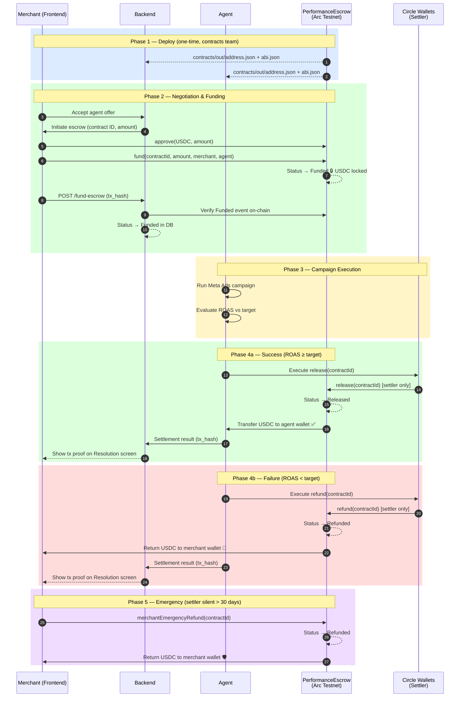
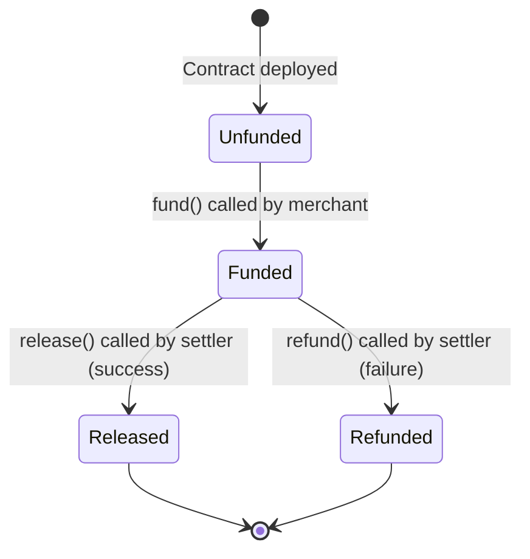
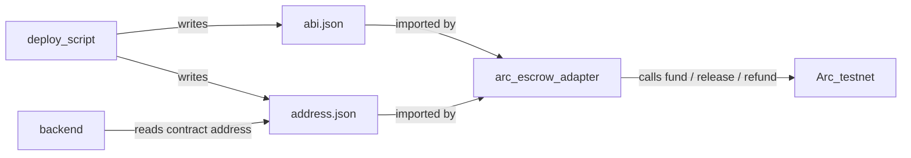

# OutcomeX — Contracts

## How the Contract Fits Into the App



---

## Purpose
The contracts folder contains the on-chain smart contract that powers the escrow and settlement mechanics. This is what makes OutcomeX trustless: neither the merchant nor the agent can move funds unilaterally — the contract enforces the agreed terms, immutably, on Arc.

---

## Team Map — Who Does What

| Component | What it owns | Submit a `needs:` ticket when... |
|---|---|---|
| **frontend** | Merchant-facing web app — all UI, Clerk auth, Circle App Kit wallet connection | You need a UI change or a new field surfaced to the merchant |
| **backend** | REST API, PostgreSQL database, state machine enforcement, Clerk JWT verification | You need a DB schema change, new endpoint, or state gate behavior |
| **agent** | ML underwriting, LLM negotiation, strategy generation, Meta Ads execution, Arc settlement | You need the agent's settler wallet address to set as the authorized settler at deploy time |
| **contracts** ← you are here | Solidity escrow contract on Arc testnet — ABI, deployed address, settlement logic | N/A — others submit tickets to you |

**Escalate to `needs: human` for:** PRD changes, spec conflicts between components, or any decision that affects more than one component's behavior.

**After every deploy:** notify backend and agent with the contract address and ABI location — they cannot function without it.

---

## Environment Setup — Getting All Keys

Complete these steps in order. Steps 1–5 are one-time only.

---

### Step 1 — Arc RPC URL

No account needed. Use the public Arc testnet endpoint directly:

```
ARC_RPC_URL=https://rpc.testnet.arc.network
```

Set this in `contracts/.env`, `agent/.env`, and `backend/.env`.

> The Arc CLI (`arc-canteen`) can also provide a personalized RPC URL.
> Install: `uv tool install git+https://github.com/the-canteen-dev/ARC-cli`
> Then: `arc-canteen login && arc-canteen rpc-url`
> Binary is at `C:\Users\<you>\.local\bin\arc-canteen.exe` (add to PATH if needed).

---

### Step 2 — Circle API Key

1. Go to **https://console.circle.com** → sign in
2. Left sidebar → **Keys** → **API Keys** → **Create API Key**
3. Type: **API Key** | Access: **Standard Key** | Name: `OutcomeX Agent`
4. Make sure the **Testnet** toggle (top-left) is active
5. Copy the key (format: `TEST_API_KEY:xxx:yyy`)

Set `CIRCLE_API_KEY` in `agent/.env` and `backend/.env`.

---

### Step 3 — Register Entity Secret & Create Agent Wallet

The entity secret is Circle's security mechanism for developer-controlled wallets. Generate and register it once, then use it to create the settler wallet.

**3a — Register entity secret in Circle Console:**

Run this to generate the encrypted ciphertext:

```powershell
cd agent
$env:CIRCLE_API_KEY = "<your key>"
.\.venv\Scripts\python.exe -c "
import base64, httpx, os, secrets
from cryptography.hazmat.primitives import hashes, serialization
from cryptography.hazmat.primitives.asymmetric import padding

entity_secret = secrets.token_hex(32)
print('ENTITY_SECRET =', entity_secret)

resp = httpx.get('https://api.circle.com/v1/w3s/config/entity/publicKey',
    headers={'Authorization': f'Bearer {os.environ[\"CIRCLE_API_KEY\"]}'})
pub = serialization.load_pem_public_key(resp.json()['data']['publicKey'].encode())
ct = pub.encrypt(bytes.fromhex(entity_secret),
    padding.OAEP(mgf=padding.MGF1(algorithm=hashes.SHA256()), algorithm=hashes.SHA256(), label=None))
print('Ciphertext =', base64.b64encode(ct).decode())
"
```

Then in the Circle Console:
- Go to **Wallets** → **DEV CONTROLLED** → **Configurator** → **Entity Secret**
- Paste the ciphertext (684 characters) → click **Register**

Save `ENTITY_SECRET` in `agent/.env`.

**3b — Create the settler wallet:**

```powershell
cd agent
$env:CIRCLE_API_KEY = "<your key>"
.\.venv\Scripts\python.exe setup_circle_wallet.py
```

This prints three values — paste them into the env files:

| Value | File | Key |
|---|---|---|
| `CIRCLE_WALLET_SET_ID` | `agent/.env` | `CIRCLE_WALLET_SET_ID` |
| `AGENT_WALLET_ID` | `agent/.env` | `AGENT_WALLET_ID` |
| `SETTLER_ADDRESS` (0x...) | `contracts/.env` | `SETTLER_ADDRESS` |

---

### Step 4 — Deployer Private Key (throwaway, one-time)

```powershell
cd contracts
node -e "const {ethers}=require('ethers'); const w=ethers.Wallet.createRandom(); console.log('DEPLOYER_PRIVATE_KEY=' + w.privateKey); console.log('Deployer address: ' + w.address)"
```

Set `DEPLOYER_PRIVATE_KEY` in `contracts/.env`. Note the deployer address for Step 5.

> This key is only used once to deploy. It is not the settler and does not control any escrows.

---

### Step 5 — Fund Deployer with USDC

1. Go to **https://faucet.circle.com**
2. Select **USDC** and **Arc Testnet**
3. Paste the deployer address from Step 4
4. Click **Send 20 USDC**

> The agent settler wallet (Step 3) is auto-funded by Circle testnet. No faucet needed for it.

---

### Step 6 — Deploy the Contract

`contracts/.env` must have all four values set before running:

```
ARC_RPC_URL=https://rpc.testnet.arc.network
DEPLOYER_PRIVATE_KEY=0x...
USDC_TOKEN_ADDRESS=0x3600000000000000000000000000000000000000
SETTLER_ADDRESS=0x...
```

Then deploy:

```powershell
cd contracts
npm install
npx hardhat compile
echo "yes" | npx hardhat run scripts/deploy.js --network arc
```

The script prints the contract address, writes `out/abi.json` and `out/address.json`.

Set `ESCROW_CONTRACT_ADDRESS` in `agent/.env` and `backend/.env`.

---

### Key Distribution Summary

| Key | contracts/.env | agent/.env | backend/.env | frontend/.env.local |
|---|---|---|---|---|
| `ARC_RPC_URL` | deploy only | required | required | — |
| `DEPLOYER_PRIVATE_KEY` | deploy only | — | — | — |
| `USDC_TOKEN_ADDRESS` | deploy only | — | — | — |
| `SETTLER_ADDRESS` | deploy only | — | — | — |
| `CIRCLE_API_KEY` | — | required | required | — |
| `CIRCLE_WALLET_SET_ID` | — | required | — | — |
| `AGENT_WALLET_ID` | — | required | — | — |
| `ENTITY_SECRET` | — | required | — | — |
| `ESCROW_CONTRACT_ADDRESS` | — | required | required | — |
| `CLERK_SECRET_KEY` | — | — | required | required |
| `NEXT_PUBLIC_CLERK_PUBLISHABLE_KEY` | — | — | — | required |

> Arc testnet USDC address is fixed: `0x3600000000000000000000000000000000000000` — do not change.
> Arc testnet explorer: **https://testnet.arcscan.app**

---

### After Deploy — What Agent and Backend Must Update

Once the contract is deployed (Step 6), two values must be propagated to the other components. Nothing else changes — these are the only post-deploy updates required.

**agent/.env** — add/update:
```
ESCROW_CONTRACT_ADDRESS=<from contracts/out/address.json>
ARC_RPC_URL=https://rpc.testnet.arc.network
```
The agent also reads `contracts/out/abi.json` automatically via `CONTRACTS_OUT_DIR` (defaults to `../contracts/out` relative to `agent/`). No copy needed if running from the same repo.

**backend/.env** — add/update:
```
ESCROW_CONTRACT_ADDRESS=<from contracts/out/address.json>
ARC_RPC_URL=https://rpc.testnet.arc.network
```

To go live (turn off mocks in agent):
```
ARC_MOCK=False
CIRCLE_MOCK=False
```

---

## Engineering Principles (Read Before Building)

---

### Principle 1: The Escrow State Machine

The contract has one linear state machine. No state can be skipped. Once settled, the contract is final.



**Immutability guarantees once funded:**
- Merchant address, agent address, and USDC amount cannot change
- Neither release nor refund can be called twice
- No mid-flight renegotiation of terms

---

### Principle 2: Role-Based Access — The Settler Pattern

Three roles. Only the `settler` can move money. The settler is the backend resolution engine's wallet — authorized at deploy time, not changeable after.

```
Merchant wallet  ──→  fund()       (deposits USDC)
Settler wallet   ──→  release()    (success: pays agent)
Settler wallet   ──→  refund()     (failure: returns to merchant)
Anyone           ──→  getStatus()  (read-only, no restrictions)

Merchant wallet  ✗   cannot call release() or refund()
Agent wallet     ✗   cannot call release() or refund()
```

**Why the settler pattern matters:** The USDC only moves after the backend's deterministic resolution engine has evaluated the outcome. The smart contract enforces that only the resolution engine's key can trigger settlement — not the merchant claiming success, not the agent claiming payment. The trust is cryptographic.

---

### Principle 3: Integration Points

The contracts folder is a **one-time deploy** that produces two output files consumed by the rest of the system.

```
contracts/
└── out/
    ├── abi.json       ← consumed by agent/adapters/arc_escrow.py
    └── address.json   ← consumed by agent/adapters/arc_escrow.py
                                  and backend/config.py
```



After deploy, copy `out/abi.json` and `out/address.json` to `contracts/out/`. The agent and backend both read from that path.

---

### Principle 4: What Arc Provides

Arc is Circle's purpose-built L1 blockchain. These properties directly affect the contract design:

| Arc property | Impact on OutcomeX |
|---|---|
| Sub-second finality | No polling loop needed — settlement confirms immediately after tx |
| ~$0.01 fees in USDC | No native gas token required; fees predictable and stablecoin-denominated |
| Paymaster support | Merchant only needs USDC — no ETH or other gas token |
| EVM-compatible | Standard Solidity + Hardhat/Foundry tooling works |

---

## Contract Interface

```solidity
// Escrow contract — three functions, one state variable

function fund(uint256 amount, address merchant, address agent) external;
// Called by merchant to lock USDC. Sets status → Funded.
// Emits: Funded(contractId, merchant, agent, amount, timestamp)

function release() external onlySetter;
// Called by settler on success. Sends USDC to agent wallet.
// Emits: Released(contractId, agent, amount, timestamp)

function refund() external onlySetter;
// Called by settler on failure. Returns USDC to merchant wallet.
// Emits: Refunded(contractId, merchant, amount, timestamp)

function getStatus() external view returns (Status);
// Returns: Unfunded | Funded | Released | Refunded
```

Security properties:
- `onlySetter` modifier: `require(msg.sender == settler, "Not authorized")`
- Double-settlement prevention: `require(status == Status.Funded, "Already settled")`
- Immutable terms: all addresses and amounts stored at `fund()` time, no setters

---

## Security Rules

### Check-Effects-Interactions — State Before Transfer

Update contract state **before** any token transfer. This closes the reentrancy window.

```solidity
// CORRECT pattern for release() and refund()
function release() external onlySetter {
    require(status == Status.Funded, "Not funded");
    status = Status.Released;                      // 1. update state
    emit Released(contractId, agent, amount, block.timestamp); // 2. emit event
    usdc.safeTransfer(agent, amount);              // 3. then transfer
}
```

Use OpenZeppelin's `SafeERC20.safeTransfer()` — it reverts on failed transfers instead of returning false silently.

### Settler Key — Circle Wallets, Not Raw Private Key

The settler wallet can drain all funded escrows if compromised. Use Circle Wallets (HSM-backed) so the raw key never exists as a string in your environment. See `agent/docs/security.md` Rule 6.

### Verify USDC Address Before Deploying

The token address is hardcoded and immutable. Deploying with the wrong address means funds are unrecoverable.

```javascript
// deploy.js — require explicit confirmation
console.log(`\nDeploying escrow contract with:`);
console.log(`  USDC token:  ${USDC_TOKEN_ADDRESS}`);
console.log(`  Settler:     ${SETTLER_ADDRESS}`);
console.log(`  Network:     ${network.name}`);

const readline = require('readline');
const rl = readline.createInterface({ input: process.stdin, output: process.stdout });
await new Promise(resolve => rl.question('\nConfirm? (yes/no): ', ans => {
    if (ans !== 'yes') { console.log('Aborted.'); process.exit(1); }
    rl.close(); resolve();
}));
```

### All Three Functions Must Emit Events

Judges verify on-chain transactions. Missing events = no proof.

```solidity
// All three must emit before returning:
emit Funded(contractId, merchant, agent, amount, block.timestamp);
emit Released(contractId, agent, amount, block.timestamp);
emit Refunded(contractId, merchant, amount, block.timestamp);
```

---

## File Structure

```
contracts/
├── src/
│   └── EscrowContract.sol    ← Core escrow contract
├── test/
│   └── Escrow.test.js        ← Unit tests: fund, release, refund, double-settlement
├── scripts/
│   └── deploy.js             ← Deploy script via ARC CLI
├── out/
│   ├── abi.json              ← Exported after deploy (consumed by agent/)
│   └── address.json          ← Exported after deploy (consumed by agent/ + backend/)
└── hardhat.config.js         ← ARC CLI RPC endpoint configuration
```

---

## Build Order

1. `src/EscrowContract.sol` — fund, release, refund, getStatus with security modifiers
2. `test/Escrow.test.js` — test all paths: fund, release, refund, double-settlement rejection, non-settler rejection
3. `scripts/deploy.js` — configurable: USDC token address, settler address
4. Deploy to Arc testnet via ARC CLI → capture contract address + deployment tx hash
5. Export `out/abi.json` + `out/address.json`
6. Wire Paymaster for both `fund()` (merchant) and `release()`/`refund()` (settler) calls
7. Verify source on Arc block explorer

---

## Demo Evidence Required

Judges inspect real on-chain transactions on Arc testnet. A mocked escrow does not score.

| Event | On-chain evidence |
|---|---|
| Merchant funds escrow | `fund()` tx hash on Arc testnet |
| Agent succeeds (ROAS 2.25 ≥ 2.0) | `release()` tx hash on Arc testnet |
| Contract status | `getStatus()` returns `Released` |

Both tx hashes are displayed on the frontend Resolution screen, linked to the Arc block explorer.

---

## What Needs to Be Built

### 1. USDC Escrow Smart Contract
Core contract with fund / release / refund / getStatus. Role-based access (settler only for settlement). Double-settlement prevention. Immutable terms once funded. See PRD Section 6.1 for full specification.

### 2. Paymaster Integration
Sponsor transaction fees in USDC for both the merchant's `fund()` call and the settler's `release()`/`refund()` calls. Merchants never hold a native gas token.

### 3. Deployment Scripts
Configurable deploy via ARC CLI. Output: contract address + deployment tx hash + network. Writes `out/abi.json` and `out/address.json` for agent and backend consumption.

---

## CLI Reference

### Arc CLI

```bash
uv tool install git+https://github.com/the-canteen-dev/ARC-cli

arc --help                    # list all available commands
arc deploy                    # deploy contract to Arc testnet
arc verify <contract-address> # verify contract source on Arc explorer
```

Docs: https://arc-node.thecanteenapp.com

> The Arc CLI is the official tool from Canteen for deploying to Arc testnet. Install it before running any deployment scripts.

### Foundry (forge / cast / anvil)

```bash
curl -L https://foundry.paradigm.xyz | bash
foundryup                     # install or update all Foundry tools
```

**forge** — build and test:
```bash
forge build                                              # compile all contracts
forge test                                               # run all tests with gas report
forge test --match-test testRelease -vvv                 # run a specific test with full trace
forge create src/Escrow.sol:Escrow --rpc-url <arc-rpc>  # deploy a contract
forge script scripts/Deploy.s.sol --rpc-url <arc-rpc> --broadcast  # scripted deploy
```

**cast** — read and interact with deployed contracts:
```bash
cast call <address> "getEscrow(bytes32)" <contractId> --rpc-url <arc-rpc>   # read escrow state
cast send <address> "release(bytes32)" <contractId> --rpc-url <arc-rpc>     # call release
cast balance <address> --rpc-url <arc-rpc>                                  # check wallet balance
```

**anvil** — local test node:
```bash
anvil                          # start local EVM node at localhost:8545
anvil --fork-url <arc-rpc>     # fork Arc testnet state locally for realistic testing
```

Docs: https://getfoundry.sh
