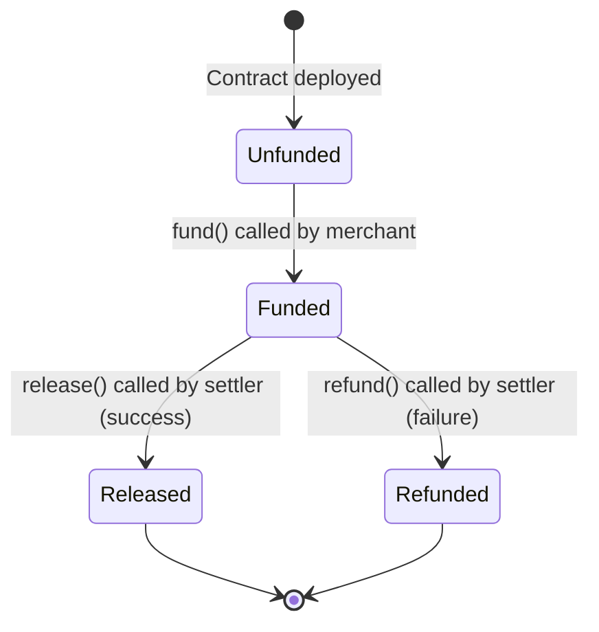
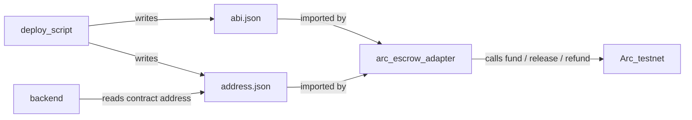

# OutcomeX — Contracts

## Purpose
The contracts folder contains the on-chain smart contract that powers the escrow and settlement mechanics. This is what makes OutcomeX trustless: neither the merchant nor the agent can move funds unilaterally — the contract enforces the agreed terms, immutably, on Arc.

---

## Engineering Principles (Read Before Building)

---

### Principle 1: The Escrow State Machine

The contract has one linear state machine. No state can be skipped. Once settled, the contract is final.



**Immutability guarantees once funded:**
- Merchant address, agent address, and USDC amount cannot change
- Neither release nor refund can be called twice
- No mid-flight renegotiation of terms

---

### Principle 2: Role-Based Access — The Settler Pattern

Three roles. Only the `settler` can move money. The settler is the backend resolution engine's wallet — authorized at deploy time, not changeable after.

```
Merchant wallet  ──→  fund()       (deposits USDC)
Settler wallet   ──→  release()    (success: pays agent)
Settler wallet   ──→  refund()     (failure: returns to merchant)
Anyone           ──→  getStatus()  (read-only, no restrictions)

Merchant wallet  ✗   cannot call release() or refund()
Agent wallet     ✗   cannot call release() or refund()
```

**Why the settler pattern matters:** The USDC only moves after the backend's deterministic resolution engine has evaluated the outcome. The smart contract enforces that only the resolution engine's key can trigger settlement — not the merchant claiming success, not the agent claiming payment. The trust is cryptographic.

---

### Principle 3: Integration Points

The contracts folder is a **one-time deploy** that produces two output files consumed by the rest of the system.

```
contracts/
└── out/
    ├── abi.json       ← consumed by agent/adapters/arc_escrow.py
    └── address.json   ← consumed by agent/adapters/arc_escrow.py
                                  and backend/config.py
```



After deploy, copy `out/abi.json` and `out/address.json` to `contracts/out/`. The agent and backend both read from that path.

---

### Principle 4: What Arc Provides

Arc is Circle's purpose-built L1 blockchain. These properties directly affect the contract design:

| Arc property | Impact on OutcomeX |
|---|---|
| Sub-second finality | No polling loop needed — settlement confirms immediately after tx |
| ~$0.01 fees in USDC | No native gas token required; fees predictable and stablecoin-denominated |
| Paymaster support | Merchant only needs USDC — no ETH or other gas token |
| EVM-compatible | Standard Solidity + Hardhat/Foundry tooling works |

---

## Contract Interface

```solidity
// Escrow contract — three functions, one state variable

function fund(uint256 amount, address merchant, address agent) external;
// Called by merchant to lock USDC. Sets status → Funded.
// Emits: Funded(contractId, merchant, agent, amount, timestamp)

function release() external onlySetter;
// Called by settler on success. Sends USDC to agent wallet.
// Emits: Released(contractId, agent, amount, timestamp)

function refund() external onlySetter;
// Called by settler on failure. Returns USDC to merchant wallet.
// Emits: Refunded(contractId, merchant, amount, timestamp)

function getStatus() external view returns (Status);
// Returns: Unfunded | Funded | Released | Refunded
```

Security properties:
- `onlySetter` modifier: `require(msg.sender == settler, "Not authorized")`
- Double-settlement prevention: `require(status == Status.Funded, "Already settled")`
- Immutable terms: all addresses and amounts stored at `fund()` time, no setters

---

## Security Rules

### Check-Effects-Interactions — State Before Transfer

Update contract state **before** any token transfer. This closes the reentrancy window.

```solidity
// CORRECT pattern for release() and refund()
function release() external onlySetter {
    require(status == Status.Funded, "Not funded");
    status = Status.Released;                      // 1. update state
    emit Released(contractId, agent, amount, block.timestamp); // 2. emit event
    usdc.safeTransfer(agent, amount);              // 3. then transfer
}
```

Use OpenZeppelin's `SafeERC20.safeTransfer()` — it reverts on failed transfers instead of returning false silently.

### Settler Key — Circle Wallets, Not Raw Private Key

The settler wallet can drain all funded escrows if compromised. Use Circle Wallets (HSM-backed) so the raw key never exists as a string in your environment. See `agent/docs/security.md` Rule 6.

### Verify USDC Address Before Deploying

The token address is hardcoded and immutable. Deploying with the wrong address means funds are unrecoverable.

```javascript
// deploy.js — require explicit confirmation
console.log(`\nDeploying escrow contract with:`);
console.log(`  USDC token:  ${USDC_TOKEN_ADDRESS}`);
console.log(`  Settler:     ${SETTLER_ADDRESS}`);
console.log(`  Network:     ${network.name}`);

const readline = require('readline');
const rl = readline.createInterface({ input: process.stdin, output: process.stdout });
await new Promise(resolve => rl.question('\nConfirm? (yes/no): ', ans => {
    if (ans !== 'yes') { console.log('Aborted.'); process.exit(1); }
    rl.close(); resolve();
}));
```

### All Three Functions Must Emit Events

Judges verify on-chain transactions. Missing events = no proof.

```solidity
// All three must emit before returning:
emit Funded(contractId, merchant, agent, amount, block.timestamp);
emit Released(contractId, agent, amount, block.timestamp);
emit Refunded(contractId, merchant, amount, block.timestamp);
```

---

## File Structure

```
contracts/
├── src/
│   └── EscrowContract.sol    ← Core escrow contract
├── test/
│   └── Escrow.test.js        ← Unit tests: fund, release, refund, double-settlement
├── scripts/
│   └── deploy.js             ← Deploy script via ARC CLI
├── out/
│   ├── abi.json              ← Exported after deploy (consumed by agent/)
│   └── address.json          ← Exported after deploy (consumed by agent/ + backend/)
└── hardhat.config.js         ← ARC CLI RPC endpoint configuration
```

---

## Build Order

1. `src/EscrowContract.sol` — fund, release, refund, getStatus with security modifiers
2. `test/Escrow.test.js` — test all paths: fund, release, refund, double-settlement rejection, non-settler rejection
3. `scripts/deploy.js` — configurable: USDC token address, settler address
4. Deploy to Arc testnet via ARC CLI → capture contract address + deployment tx hash
5. Export `out/abi.json` + `out/address.json`
6. Wire Paymaster for both `fund()` (merchant) and `release()`/`refund()` (settler) calls
7. Verify source on Arc block explorer

---

## Demo Evidence Required

Judges inspect real on-chain transactions on Arc testnet. A mocked escrow does not score.

| Event | On-chain evidence |
|---|---|
| Merchant funds escrow | `fund()` tx hash on Arc testnet |
| Agent succeeds (ROAS 2.25 ≥ 2.0) | `release()` tx hash on Arc testnet |
| Contract status | `getStatus()` returns `Released` |

Both tx hashes are displayed on the frontend Resolution screen, linked to the Arc block explorer.

---

## What Needs to Be Built

### 1. USDC Escrow Smart Contract
Core contract with fund / release / refund / getStatus. Role-based access (settler only for settlement). Double-settlement prevention. Immutable terms once funded. See PRD Section 6.1 for full specification.

### 2. Paymaster Integration
Sponsor transaction fees in USDC for both the merchant's `fund()` call and the settler's `release()`/`refund()` calls. Merchants never hold a native gas token.

### 3. Deployment Scripts
Configurable deploy via ARC CLI. Output: contract address + deployment tx hash + network. Writes `out/abi.json` and `out/address.json` for agent and backend consumption.
