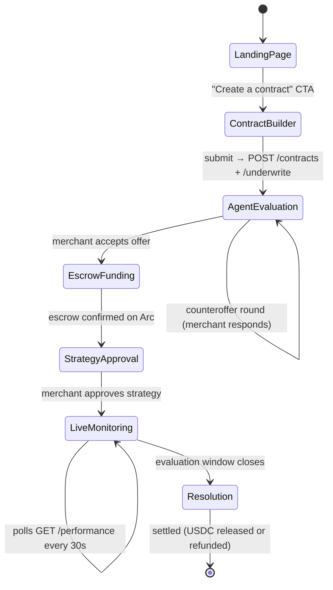

# OutcomeX — Frontend

## Purpose
The frontend is the merchant-facing web app. It guides the merchant through the full lifecycle of a performance contract: creating it, reviewing the agent's decision, funding escrow, approving the strategy, monitoring the campaign, and seeing the final settlement.

**The frontend renders state. It does not contain business logic.**

---

## Engineering Principles (Read Before Building)

---

### Principle 1: The UI is Fully Decoupled from the Agent

The UI never talks to the agent directly. It reads state from the backend (which reads from DB) and renders it. The agent runs in the background, writes to DB, and the UI reflects those writes on the next poll.

```
Merchant
   ↓  (clicks, fills forms)
Frontend  ──→  Backend API  ──→  Database
                                    ↑
                            Agent scheduler
                            (writes snapshots,
                             updates asynchronously)
```

**Implication:** When the merchant opens the monitoring screen, the data is already in the DB from the last scheduled agent run. The frontend never waits for the agent to run — it just reads the latest state.

---

### Principle 2: Screen → Contract State Mapping

Each screen corresponds to exactly one contract state. Navigation follows the state machine. No skipping steps.



If a contract is in `Active` state, the app routes directly to LiveMonitoring. Contract state drives routing, not URL history.

---

### Principle 3: Two Hard Approval Gates

Two actions require explicit merchant approval. The buttons must be **disabled** until the content that requires approval is fully visible on screen. This is the harness — enforce it in code, not in user instructions.

| Gate | Button disabled until... | Why |
|---|---|---|
| **Fund escrow** | All contract terms rendered (target, spend floor, window, fee, refund logic) | Merchant must see exactly what they're locking |
| **Approve execution** | Full strategy plan rendered (summary + all actions listed) | No ad runs without explicit authorization |

```tsx
// Example: Fund button gated on terms being loaded
<Button
  disabled={!termsLoaded || isLoading}
  onClick={handleFundEscrow}
>
  Fund {contract.success_fee_usdc} USDC
</Button>
```

---

### Principle 4: Workspace Restore — Two-Step Hydration

When a merchant reopens their workspace, the UI must look exactly as they left it: full conversation history, approval cards in their original state (DONE / AWAITING), ROAS chart, lifecycle panel.

This is a two-step process on mount:

```typescript
useEffect(() => {
  // Step 1: hydrate full timeline from DB (one request, all history)
  const messages = await api.getMessages(contractId);
  setTimeline(messages);

  // Step 2: open SSE stream for live updates going forward
  const es = new EventSource(`/api/contracts/${contractId}/events`);

  es.addEventListener('message',          (e) => appendToTimeline(JSON.parse(e.data)));
  es.addEventListener('daily_update',     (e) => appendToTimeline(JSON.parse(e.data)));
  es.addEventListener('approval_request', (e) => appendToTimeline(JSON.parse(e.data)));
  es.addEventListener('system_event',     (e) => appendToTimeline(JSON.parse(e.data)));

  return () => es.close();
}, [contractId]);
```

### Principle 5: Render the Timeline by Message Type

Each row from `GET /messages` renders differently based on its `type` field. No reconstruction logic — the DB row already has everything needed to render.

```typescript
function TimelineItem({ message }: { message: ContractMessage }) {
  switch (message.type) {
    case 'system_event':      return <SystemBanner content={message.content} />;
    case 'message':
      return message.role === 'agent'
        ? <AgentBubble content={message.content} metadata={message.metadata} />
        : <MerchantBubble content={message.content} />;
    case 'daily_update':      return <DailyUpdateCard metadata={message.metadata} />;
    case 'approval_request':  return <ApprovalCard message={message} />;
  }
}
```

The `ApprovalCard` reads `message.status` — `pending` renders Approve/Request changes buttons; `approved` or `declined` renders the DONE badge. This state comes from the DB, so it survives page reload.

### Principle 6: LLM Response Streaming

Chat responses stream token-by-token. Use `fetch` with `ReadableStream` — not `EventSource` (which is GET-only).

```typescript
async function sendMessage(contractId: string, content: string) {
  // Optimistically show the merchant message immediately
  appendToTimeline({ role: 'merchant', type: 'message', content });

  const res = await fetch(`/api/contracts/${contractId}/chat/stream`, {
    method: 'POST',
    headers: { 'Content-Type': 'application/json' },
    body: JSON.stringify({ message: content }),
  });

  const reader = res.body!.getReader();
  const decoder = new TextDecoder();
  let agentText = '';

  // Add an empty agent bubble that fills in as chunks arrive
  const bubbleId = appendStreamingBubble();

  while (true) {
    const { done, value } = await reader.read();
    if (done) break;
    const lines = decoder.decode(value).split('\n');
    for (const line of lines) {
      if (line.startsWith('data: ') && line !== 'data: [DONE]') {
        const { text } = JSON.parse(line.slice(6));
        agentText += text;
        updateStreamingBubble(bubbleId, agentText);  // update in place
      }
    }
  }
}
```

### Principle 7: Chat is Q&A, Not a Command Interface

The chat input triggers the streaming endpoint. The agent reads current contract state and answers — it does not execute ad actions or strategy changes from the chat box.

If the merchant requests a change, the agent queues it as an `approval_request` message — which surfaces as a new approval card in the timeline. It still goes through the approval gate.

---

### Principle 5: Make Agent Intelligence Visible

From the judging criteria: "The UI must make agent decision-making visible so judges can see the agent is actually deciding, not just automating."

Show these on every relevant screen:
- Success probability (with the source: "ML model estimate")
- The agent's reasoning in plain language (from LLM negotiation output)
- Live ROAS trend vs. target (the trajectory matters, not just the current value)
- On-chain tx hashes as clickable proof for every fund movement

---

## Screen → Component Map

```
frontend/
├── app/
│   ├── page.tsx                    ← Landing page
│   ├── contracts/
│   │   ├── new/page.tsx            ← Contract Builder (4.2)
│   │   └── [id]/
│   │       ├── evaluate/page.tsx   ← Agent Evaluation (4.3)
│   │       ├── escrow/page.tsx     ← Escrow Funding (4.4)
│   │       ├── strategy/page.tsx   ← Strategy Approval (4.5)
│   │       ├── monitor/page.tsx    ← Live Monitoring Dashboard (4.6)
│   │       └── resolution/page.tsx ← Resolution & Settlement (4.7)
├── lib/
│   ├── api.ts                      ← Typed wrappers for all backend endpoints
│   └── types.ts                    ← TypeScript types (match backend Pydantic schemas)
└── components/
    ├── ContractTermsSummary.tsx    ← Shared: renders agreed terms
    ├── ApprovalGate.tsx            ← Shared: disabled button until content loaded
    ├── ROASChart.tsx               ← ROAS trend chart
    ├── SuccessProbabilityBar.tsx   ← Visual probability display
    ├── TxHashLink.tsx              ← Clickable Arc block explorer link
    └── ChatInput.tsx               ← Q&A chat (read-only, no execution)
```

---

## Data Flow Per Screen

| Screen | Data source | Refresh strategy |
|---|---|---|
| Contract Builder | Form state (local) | n/a |
| Agent Evaluation | `GET /messages` + SSE `/events` | Hydrate on load, SSE for new turns |
| Escrow Funding | `GET /contracts/:id` | On load |
| Strategy Approval | `GET /messages` + SSE `/events` | Hydrate on load, SSE for approval card |
| Live Monitoring | `GET /messages` (hydrate) + SSE `/events` (live) | Two-step hydration on mount |
| Resolution | `GET /messages` | On load (contract is settled, no live updates) |

**Key principle:** All screens that show the conversation timeline use the same two-step hydration pattern — `GET /messages` on mount, then SSE for new events. The right panel (lifecycle, strategy terms, live ROAS) reads from `GET /contracts/:id` and `GET /performance`.

---

## Build Order

1. **Clerk setup** — `npm install @clerk/nextjs`; wrap `app/layout.tsx` in `<ClerkProvider>`; add `middleware.ts` to protect `/contracts/*` routes; add `NEXT_PUBLIC_CLERK_PUBLISHABLE_KEY` + `CLERK_SECRET_KEY` to `.env.local`
2. `lib/types.ts` — TypeScript types for `ContractMessage`, `ContractState`, all response shapes
3. `lib/api.ts` — typed fetch wrappers for all 14 endpoints; every fetch attaches `Authorization: Bearer <clerk-token>` via `getToken()` from `useAuth()`
4. `lib/useMessages.ts` — custom hook: `GET /messages` + SSE hydration pattern (reused across all screens)
5. `lib/useStreamingChat.ts` — custom hook: `POST /chat/stream` with ReadableStream handling
6. `components/TimelineItem.tsx` — renders any message by type (system_event / message / daily_update / approval_request)
7. `components/ApprovalCard.tsx` — pending vs. approved/declined state from `message.status`
8. Landing page
9. Contract Builder form (protected route — Clerk redirects unauthenticated users to sign-in)
10. Agent Evaluation screen (uses `useMessages`, renders negotiation turns)
11. Escrow Funding screen (Circle App Kit for USDC send — wallet connect happens here, not at sign-in)
12. Strategy Approval screen (uses `useMessages`, `ApprovalCard` for strategy)
13. Live Monitoring Dashboard (uses `useMessages` + `ROASChart`)
14. Resolution & Settlement screen (tx hash links to Arc explorer)
15. Chat input (uses `useStreamingChat`)

---

## What Needs to Be Built

### 1. Landing Page
Core message: merchants pay only when the AI agent delivers the contracted outcome. Old model vs. OutcomeX model comparison. CTA to create a contract.

### 2. Contract Builder
Form: target ROAS threshold, minimum spend, time window (days), success fee (USDC), campaign mode, ad account context. On submit: `POST /contracts` → navigate to Agent Evaluation.

### 3. Agent Evaluation Screen
Shows: probability, risk level, expected ROAS range, agent decision, LLM explanation. Handles counteroffer: shows revised terms, merchant can accept or propose changes. Shows the negotiation loop progressing.

### 4. Escrow Funding Screen
Shows full agreed terms before the fund button activates. Uses Circle App Kit for the USDC send action. Shows Arc tx hash after funding confirms.

### 5. Strategy Approval Screen
Shows strategy summary in plain language. Lists all planned ad actions. Approve button activates only after plan is fully loaded. No execution happens without clicking Approve.

### 6. Live Monitoring Dashboard
Polls every 30s. Shows: current vs. target ROAS, spend progress, days remaining, ML success probability, contract status badge. ROAS trend chart over time.

### 7. Resolution & Settlement Screen
Shows: final ROAS, final spend, outcome verdict (success/failure), settlement action, Arc tx hash for settlement. On success: "100 USDC released to agent wallet." On failure: "100 USDC refunded to your wallet."

---

## Security Rules

### Never Render LLM Output as Raw HTML

```tsx
// WRONG — stored XSS if LLM output contains script tags
<div dangerouslySetInnerHTML={{ __html: message.content }} />

// CORRECT — sanitized markdown renderer
import ReactMarkdown from 'react-markdown';
<ReactMarkdown
  components={{
    a: ({ href, children }) => (
      <a href={href} target="_blank" rel="noopener noreferrer">{children}</a>
    ),
    html: () => null,   // disallow raw HTML in markdown source
  }}
>
  {message.content}
</ReactMarkdown>
```

### Approval Gates Are UX Only — Backend is the Real Enforcement

The disabled Approve button is a convenience. A determined attacker bypasses the frontend and calls the API directly. The backend state gate (`strategy_plans.approval_status` DB check) is the actual security control. Both must exist; only the backend gate provides security.

### USDC Amounts — Display Exact Values, Never Round

```tsx
// WRONG — rounds 100.5 to "100", merchant funds more than shown
<span>{Math.floor(contract.success_fee_usdc)} USDC</span>

// CORRECT — full precision
<span>{contract.success_fee_usdc.toFixed(2)} USDC</span>
```

### Validate Tx Hashes Before Constructing Explorer Links

```typescript
const TX_HASH_REGEX = /^0x[a-fA-F0-9]{64}$/;

function TxHashLink({ hash }: { hash: string }) {
  if (!TX_HASH_REGEX.test(hash)) return <span>{hash}</span>;
  return (
    <a href={`${ARC_EXPLORER_URL}/tx/${hash}`} target="_blank" rel="noopener noreferrer">
      {hash.slice(0, 10)}...{hash.slice(-6)}
    </a>
  );
}
```

### Session Token in Memory, Not localStorage

```typescript
// WRONG — readable by any XSS script
localStorage.setItem('auth_token', token);

// CORRECT — lives in memory only
let authToken: string | null = null;
export const setAuthToken = (t: string) => { authToken = t; };
export const getAuthToken = () => authToken;
```

Token is lost on page refresh; the wallet re-signs to obtain a new one. This is the correct tradeoff for a financial application.

---

## CLI Reference

### Next.js

```bash
npm run dev          # start dev server at localhost:3000 with hot reload
npm run build        # production build — run before deploying
npm run start        # serve production build locally
npx next info        # print system info for bug reports
```

Docs: https://nextjs.org/docs/app/api-reference/cli/next

### Clerk CLI

```bash
npm install -g clerk

clerk init           # auto-detect framework, install SDK, scaffold auth pages and middleware.ts
clerk env pull       # pull NEXT_PUBLIC_CLERK_PUBLISHABLE_KEY and CLERK_SECRET_KEY into .env.local
clerk doctor         # validate Clerk integration and flag common misconfigurations
clerk open           # open Clerk dashboard in browser
```

Docs: https://clerk.com/docs/cli

> Run `clerk env pull` first on a new machine — it saves you manually copying keys from the dashboard.
