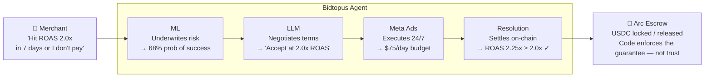
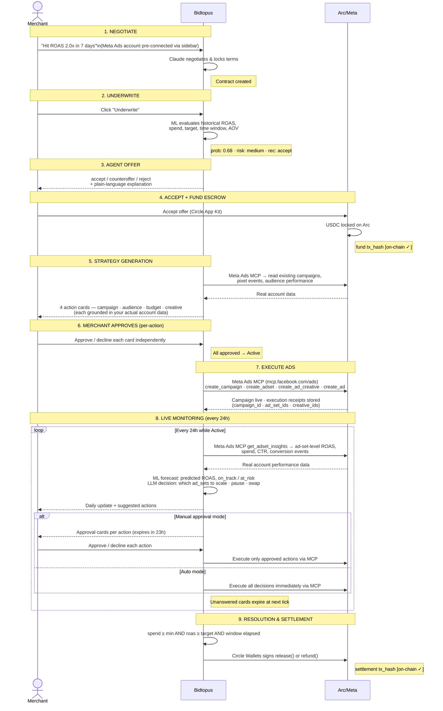
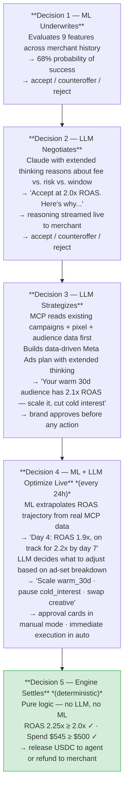
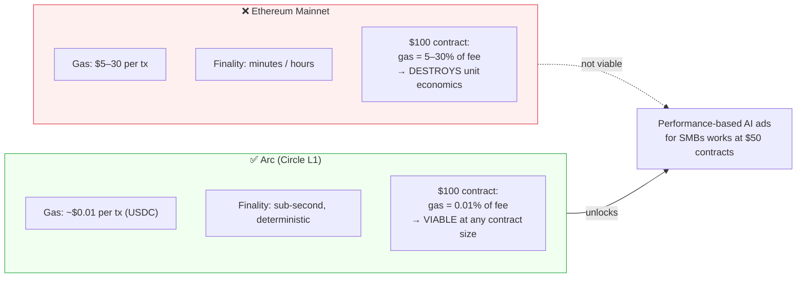
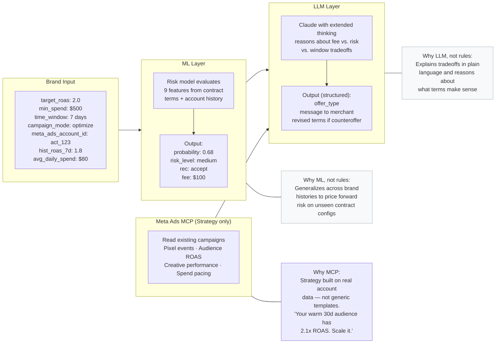
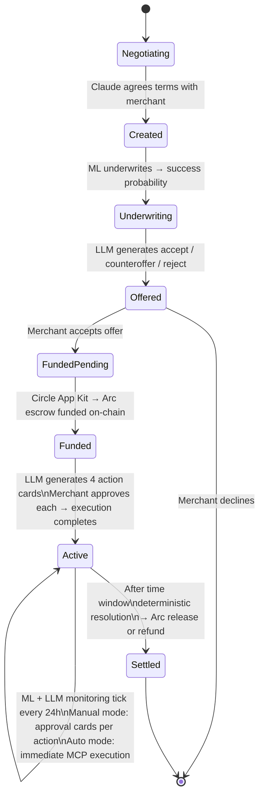

# Bidtopus — System Diagram & Architecture

---

## The Core Concept: A Risk-Sharing Economic Agent

---

## Full Contract Lifecycle Flow

---

## The 5 Autonomous Decisions

These are the five points where Bidtopus *decides*, not just *executes*:

**The LLM never makes the settlement call.** The resolution engine is deterministic logic — `roas >= target AND spend >= minimum`. This is auditable, tamper-proof, and cannot be influenced by either party. The LLM narrates the result; the math makes the decision.

---

## Circle Stack

| Circle Product | How Bidtopus Uses It | Lifecycle Step |
|---|---|---|
| **Arc Escrow** | USDC locked at contract signing. Released on success, refunded on failure. Code enforces the guarantee — not the agent's word. | Step 4: Fund · Step 9: Settle |
| **Circle Wallets** | Agent's receiving wallet. Funded by Arc escrow on success. Automated HSM-backed key management — agent never touches raw keys. | Step 9: Success path |
| **Paymaster** | All on-chain transactions (fund, release, refund) paid in USDC. No volatile gas token. Merchant pays in USDC, agent earns in USDC — fees are invisible. | Steps 4, 9 |
| **App Kit** | Drop-in wallet component in the merchant's browser. One-click USDC funding. No MetaMask required. | Step 4: Fund Escrow |
| **USYC** *(roadmap)* | Park idle escrowed USDC in yield while contract is Active. Convert back to USDC at resolution. Merchant capital earns while the agent works. | Active (days 1–7) |

---

## Why Arc Makes This Possible

A $100 USDC success fee contract on Ethereum mainnet loses 5–30% to gas before either party earns anything. On Arc it loses 0.01%. That is the business model unlock.

---

## How ML and LLM Work Together

---

## Contract Status Flow

---

## Competitor Landscape

| | AI Execution | On-chain Escrow | Pay on Outcome | ML Underwriting |
|---|---|---|---|---|
| AdAmigo | ✓ | ✗ | ✗ | ✗ |
| Uniscrow | ✗ | ✓ | ✓ | ✗ |
| Leadzai | Partial | ✗ | ✓ | ✗ |
| Madgicx / Ryze | ✓ | ✗ | ✗ | ✗ |
| **Bidtopus** | **✓** | **✓** | **✓** | **✓** |

No existing platform sits at this intersection.
